# The Fast Food Fallacy: Why the Loudest Voices in Tech Are Often Wrong

## 🗺️ Topic Mind Map

```mermaid
graph TD
    FAST["The Fast Food Fallacy"]

    %% Branches
    FAST --> MECHANISM["1. The Attention Economy Incentive"]
    FAST --> SURVIVOR["2. The Inverted Survivorship Bias"]
    FAST --> AI_AMPLIFIER["3. AI & Quantity Over Quality"]
    FAST --> STEELMAN["4. Counter-Perspective & Nuance"]
    FAST --> SOLUTIONS["5. Finding the True Signal"]

    %% Mechanism
    MECHANISM --> SPEED["Speed & Outrage over Nuance & Production Scars"]
    MECHANISM --> MONETIZATION["Monetizing engagement vs building real software"]

    %% Survivor
    SURVIVOR --> BUILDERS["The best engineers are busy building, maintaining, and on-call"]
    SURVIVOR --> INFLUENCERS["The loudest commentators often haven't held long-term production accountability"]

    %% AI
    AI_AMPLIFIER --> SLOP["AI algorithms reward frequency and volume over deep insight"]
    AI_AMPLIFIER --> ECHO["Echo chambers regurgitating buzzwords without context"]

    %% Steelman
    STEELMAN --> ACCESSIBLE["Content creators make tech accessible to newcomers"]
    STEELMAN --> TIME_INVESTMENT["High-quality educational content requires full-time effort"]

    %% Solutions
    SOLUTIONS --> RADAR["Evaluating scars over charisma"]
    SOLUTIONS --> QUESTIONS["Asking: 'What broke in production when you ran this?'"]
```

---

## 1. Core Thesis & Nuance

### The Core Premise

In tech media and social algorithms, the loudest and most pervasive voices are rarely the ones doing
the heavy lifting in production. Algorithms naturally favor rapid output, dogmatic certainty, and
engagement-bait ("X is DEAD!"). Meanwhile, senior practitioners with decades of battle scars are
busy debugging, refactoring, and delivering business value. AI search and recommendation feeds have
amplified this by rewarding quantity over depth, making true wisdom harder to find through the
noise.

### The Counter-Perspective (Steel-Manning Content Creators)

1. **The Accessibility Value**: Junior engineers and career switchers genuinely benefit from
   high-energy, simplified tutorials that get them started quickly.
2. **The Full-Time Demands of Education**: Producing great educational media takes immense time;
   engineers who spend 50 hours a week in production rarely have the bandwidth to write
   comprehensive guides.
3. **Public Experimentation**: Some vocal creators are early adopters testing cutting-edge tools
   before enterprise teams can touch them.

### Blind Spots & Nuances

- Avoiding gatekeeping: Experience does not guarantee immunity from bad habits; sometimes fresh
  voices spot blind spots that veterans ignore.
- The danger of cynicism: Not every popular voice is empty; discernment is about evaluating
  arguments, not just tenure.

---

## 2. Evidence & Story Bank

### Personal Anecdotes

- Watching junior devs get misled by trendy Twitter/YouTube influencers advocating patterns that
  completely crash under real production load.
- Experiencing the quiet competence of lead engineers whose code powers massive systems without ever
  writing a tweet about it.

### Metaphors & Analogies

- **Fast Food vs. Farm-to-Table**: Fast food is engineered to be loud, bright, addictive, and fast
  to consume—but it provides no long-term nutritional value. Production wisdom is like slow,
  nutrient-dense cooking; it takes time to prepare, but it actually sustains the body.

---

## 3. Multi-Channel Repurposing Matrix

### Medium (Anchor Essay)

- **Title**: _The Fast Food Fallacy: Why the Loudest Voices in Tech are the Least Qualified to
  Advise You_
- **Sections**:
  1. The Inverted Survivorship Bias of Developer Social Media.
  2. The Anatomy of an Engagement Trap.
  3. Why AI Has Multiplied the Noise 100x.
  4. The 3 Questions to Ask Before Following Any Tech Guru.

### BlueSky (Thread)

- **Hook**: "The developers who know how to scale a system to 10 million users rarely have time to
  post 5 threads a day about it. Here is why the tech attention economy is built on a fundamental
  contradiction: 🧵"

---

## 4. Interactive Discussion Prompt

> _"What is a piece of popular tech advice you heard online that turned out to be an absolute
> disaster when you tried to use it in real production?"_
