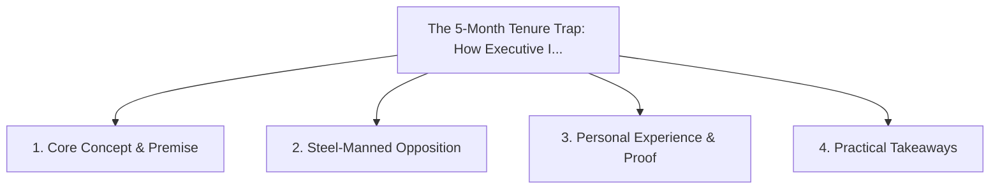

# The 5-Month Tenure Trap: How Executive Incentives Destroy Long-Term Enterprise Value

<!-- prettier-ignore-start -->
<!-- markdownlint-disable MD013 -->
**Series Context**: Part 2 of the [[topics/documents/series-the-evolution-beyond-extractive-capitalism|The Evolution Beyond Extractive Capitalism & The Myth of Self-Interest]] series.
<!-- markdownlint-restore -->
<!-- prettier-ignore-end -->

---

## 🗺️ Topic Mind Map

---

## 1. Deep-Dive Knowledge & Context

### Core Insight

Transient executives are incentivized to slash R&D, lay off key talent, pump short-term numbers, and
cash out stock before the structural decay hits.

### Counter-Perspective (Steel-Manning)

Performance-based equity grants with multi-year vesting schedules attempt to align leadership with
long-term health.

### Nuances & Blind Spots

- Practical implementation edge cases when adopting this approach in production environments.
- Distinguishing between dogmatic application and context-sensitive pragmatism.

---

## 2. Evidence, Stories & Reference Vault

### Personal Anecdotes & Field Experience

- Inheriting an enterprise platform after an executive slashed the testing team, pocketed a bonus,
  and moved to another company.

### Metaphors & Analogies

- **A tenant stripping copper wiring from the walls the night before moving out.**

---

## 3. Practical Action & Takeaways

1. **First Step**: Audit existing workflows or codebases for this specific failure mode or pattern.
2. **Rule of Thumb**: Prefer explicit, decoupled, and durable implementations over transient
   convenience.
3. **Core Metric**: Reduced maintenance friction, lower cognitive load, and sustained velocity.

---

## 4. Multi-Channel Repurposing Matrix

### Medium / Substack (Focused Deep Dive)

- Narrative arc exploring the problem, field scar tissue, counter-arguments, and solution.

### BlueSky (Micro & Thread Hook)

- **Hook**: "A counter-intuitive lesson from 20+ years of engineering: Transient executives are
  incentivized to slash R&D, lay off key talent, pump short-term numbers, and cash out stock befo...
  🧵"

### YouTube / TikTok (Short & Video Vector)

- **Hook**: 60-second walkthrough centered on the metaphor: _A tenant stripping copper wiring from
  the walls the night before moving out._.
