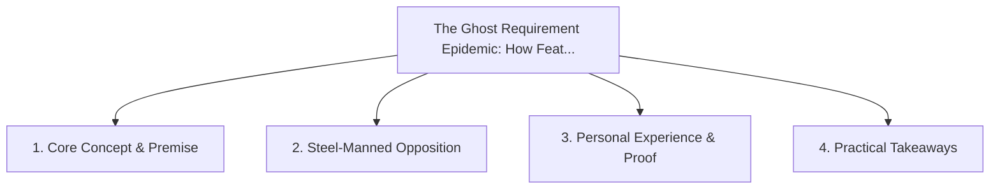

# The Ghost Requirement Epidemic: How Features Drift from Intent to PR

<!-- prettier-ignore-start -->
<!-- markdownlint-disable MD013 -->
**Series Context**: Part 1 of the [[topics/documents/series-living-requirements-ai-traceability|Living Requirements & End-to-End AI Traceability]] series.
<!-- markdownlint-restore -->
<!-- prettier-ignore-end -->

---

## 🗺️ Topic Mind Map

---

## 1. Deep-Dive Knowledge & Context

### Core Insight

Features inevitably drift across handoffs (Product -> Jira -> Design -> Code); without active AI
auditing, shipped software solves the wrong problem.

### Counter-Perspective (Steel-Manning)

Tight daily cross-functional standups keep teams aligned without heavy tooling.

### Nuances & Blind Spots

- Practical implementation edge cases when adopting this approach in production environments.
- Distinguishing between dogmatic application and context-sensitive pragmatism.

---

## 2. Evidence, Stories & Reference Vault

### Personal Anecdotes & Field Experience

- Spending 6 months building a feature that failed customer needs because a key caveat was dropped
  in Jira ticket grooming.

### Metaphors & Analogies

- **A game of telephone played between executives, product managers, and developers.**

---

## 3. Practical Action & Takeaways

1. **First Step**: Audit existing workflows or codebases for this specific failure mode or pattern.
2. **Rule of Thumb**: Prefer explicit, decoupled, and durable implementations over transient
   convenience.
3. **Core Metric**: Reduced maintenance friction, lower cognitive load, and sustained velocity.

---

## 4. Multi-Channel Repurposing Matrix

### Medium / Substack (Focused Deep Dive)

- Narrative arc exploring the problem, field scar tissue, counter-arguments, and solution.

### BlueSky (Micro & Thread Hook)

- **Hook**: "A counter-intuitive lesson from 20+ years of engineering: Features inevitably drift
  across handoffs (Product -> Jira -> Design -> Code); without active AI auditing, shipped softw...
  🧵"

### YouTube / TikTok (Short & Video Vector)

- **Hook**: 60-second walkthrough centered on the metaphor: _A game of telephone played between
  executives, product managers, and developers._.
