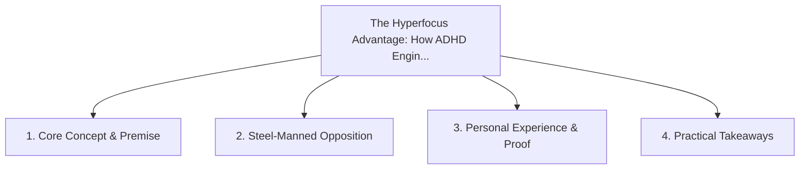

# The Hyperfocus Advantage: How ADHD Engineers Build Complex Systems

<!-- prettier-ignore-start -->
<!-- markdownlint-disable MD013 -->
**Series Context**: Part 1 of the [[topics/documents/series-neurodiversity-and-systems-thinking|Neurodiversity, ADHD & Systems Thinking in Tech]] series.
<!-- markdownlint-restore -->
<!-- prettier-ignore-end -->

---

## 🗺️ Topic Mind Map

---

## 1. Deep-Dive Knowledge & Context

### Core Insight

Hyperfocus is not a deficit of attention, but an intense state of high-bandwidth synthesis that can
solve intractable architectural puzzles.

### Counter-Perspective (Steel-Manning)

Hyperfocus often comes at the expense of ignoring basic biological needs and mundane operational
tasks.

### Nuances & Blind Spots

- Practical implementation edge cases when adopting this approach in production environments.
- Distinguishing between dogmatic application and context-sensitive pragmatism.

---

## 2. Evidence, Stories & Reference Vault

### Personal Anecdotes & Field Experience

- Solving a multi-threaded memory corruption bug during an uninterrupted 14-hour hyperfocus session.

### Metaphors & Analogies

- **A focused laser beam cutting through diamond vs a dispersed incandescent lightbulb.**

---

## 3. Practical Action & Takeaways

1. **First Step**: Audit existing workflows or codebases for this specific failure mode or pattern.
2. **Rule of Thumb**: Prefer explicit, decoupled, and durable implementations over transient
   convenience.
3. **Core Metric**: Reduced maintenance friction, lower cognitive load, and sustained velocity.

---

## 4. Multi-Channel Repurposing Matrix

### Medium / Substack (Focused Deep Dive)

- Narrative arc exploring the problem, field scar tissue, counter-arguments, and solution.

### BlueSky (Micro & Thread Hook)

- **Hook**: "A counter-intuitive lesson from 20+ years of engineering: Hyperfocus is not a deficit
  of attention, but an intense state of high-bandwidth synthesis that can solve intractable ar...
  🧵"

### YouTube / TikTok (Short & Video Vector)

- **Hook**: 60-second walkthrough centered on the metaphor: _A focused laser beam cutting through
  diamond vs a dispersed incandescent lightbulb._.
