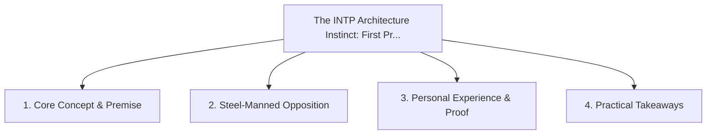

# The INTP Architecture Instinct: First Principles Over Industry Dogma

<!-- prettier-ignore-start -->
<!-- markdownlint-disable MD013 -->
**Series Context**: Part 3 of the [[topics/documents/series-neurodiversity-and-systems-thinking|Neurodiversity, ADHD & Systems Thinking in Tech]] series.
<!-- markdownlint-restore -->
<!-- prettier-ignore-end -->

---

## 🗺️ Topic Mind Map

---

## 1. Deep-Dive Knowledge & Context

### Core Insight

The INTP drive to dismantle concepts to their bare logical roots is the antidote to cargo-cult
software engineering and hype cycles.

### Counter-Perspective (Steel-Manning)

First-principles over-analysis can delay practical shipping when an existing imperfect solution
works.

### Nuances & Blind Spots

- Practical implementation edge cases when adopting this approach in production environments.
- Distinguishing between dogmatic application and context-sensitive pragmatism.

---

## 2. Evidence, Stories & Reference Vault

### Personal Anecdotes & Field Experience

- Refusing to adopt a trending tech stack because its underlying concurrency model violated basic
  physics.

### Metaphors & Analogies

- **Inspecting the bedrock and rebar before trusting the decorative marble facade.**

---

## 3. Practical Action & Takeaways

1. **First Step**: Audit existing workflows or codebases for this specific failure mode or pattern.
2. **Rule of Thumb**: Prefer explicit, decoupled, and durable implementations over transient
   convenience.
3. **Core Metric**: Reduced maintenance friction, lower cognitive load, and sustained velocity.

---

## 4. Multi-Channel Repurposing Matrix

### Medium / Substack (Focused Deep Dive)

- Narrative arc exploring the problem, field scar tissue, counter-arguments, and solution.

### BlueSky (Micro & Thread Hook)

- **Hook**: "A counter-intuitive lesson from 20+ years of engineering: The INTP drive to dismantle
  concepts to their bare logical roots is the antidote to cargo-cult software engineering and ...
  🧵"

### YouTube / TikTok (Short & Video Vector)

- **Hook**: 60-second walkthrough centered on the metaphor: _Inspecting the bedrock and rebar before
  trusting the decorative marble facade._.
