# The Loyalty Trap: Why Tenure Doesn't Equal Talent (or Skill)

## Metadata
- **ID**: `TOP-008`
- **Pillar**: Pillar 2: Org Culture & Leadership
- **Status**: Outlined
- **Primary Keywords**: #CareerGrowth #Tenure #SoftwareEngineering #Leadership #Meritocracy #CompanyCulture
- **Related Topics**: [[topics/the-500-dollar-aspirin.md|The $500 Aspirin]], [[topics/the-charisma-trap.md|The Charisma Trap]], [[topics/the-danger-of-being-the-smartest-in-the-room.md|Danger of Being the Smartest in the Room]]
- **Target Channels**: Medium (Anchor Essay), BlueSky (Thread), YouTube/Shorts (Career Lesson)

---

## 🗺️ Topic Mind Map

```mermaid
graph TD
    LOYALTY["The Loyalty Trap"]

    %% Branches
    LOYALTY --> TENURE_VS_SKILL["1. Tenure vs Skill Paradox"]
    LOYALTY --> CULTURAL["2. Institutional Stagnation"]
    LOYALTY --> INCENTIVES["3. Misaligned Corporate Incentives"]
    LOYALTY --> STEELMAN["4. Counter-Perspective & Value of Tenure"]
    LOYALTY --> REPURPOSE["5. Multi-Channel Formats"]

    %% Tenure vs Skill
    TENURE_VS_SKILL --> DURATION["10 years of experience vs 1 year repeated 10 times"]
    TENURE_VS_SKILL --> COMFORT["Mistaking familiarity with legacy quirks for technical mastery"]

    %% Cultural
    CULTURAL --> GATEKEEPING["Tenured gatekeepers resisting architectural progress"]
    CULTURAL --> BLINDNESS["'That's just the way we do things here'"]

    %% Incentives
    INCENTIVES --> PROMOTIONS["Promoting for longevity rather than impact and growth"]
    INCENTIVES --> PUNISHING_LOYALTY["Companies underpaying tenured talent while overpaying new hires"]

    %% Steelman
    STEELMAN --> DOMAIN["Deep institutional domain knowledge & historical context"]
    STEELMAN --> CULTURAL_GLUE["Cultural stability and operational continuity during crises"]

    %% Repurpose
    REPURPOSE --> MED["Medium: Provocative Leadership Essay"]
    REPURPOSE --> BS["BlueSky: Career Wisdom Thread"]
    REPURPOSE --> YT["YouTube: Candid Career Reflection"]
```

---

## 1. Core Thesis & Nuance

### The Core Premise
In many tech organizations, tenure is treated as a direct proxy for competence, leadership readiness, and architectural authority. However, there is a profound difference between having ten years of varied, reflective experience and having one year of experience repeated ten times. When longevity alone determines seniority, companies risk institutional stagnation, where tenured gatekeepers defend obsolete architectures simply because they built them.

### The Counter-Perspective (Steel-Manning Tenure)
1. **Institutional Memory**: Long-tenured engineers know *why* the bodies are buried where they are—saving the team from repeating catastrophic historical mistakes.
2. **Domain Complexity**: In highly regulated or complex legacy industries (finance, healthcare), domain nuance takes years to master.
3. **Commitment & Stability**: High employee retention provides cultural continuity and reduces onboarding churn.

### Blind Spots & Nuances
- Disillusioned new hires assuming all legacy code is "bad" without understanding the business constraints under which it was built.
- Recognizing when tenured engineers *are* the heart and soul of the organization vs. when they are coasting.

---

## 2. Evidence & Story Bank

### Personal Anecdotes
- Seeing engineers with 15 years at a single company struggle to adapt to basic modern testing or architecture because they only knew the proprietary internal tools.
- Instances where loyalty was penalized: new hires brought in at 40% higher salaries while tenured experts were capped at 3% annual merit increases.

### Metaphors & Analogies
- **The Tree Rings**: A tree grows rings year after year, expanding in strength and resilience. But a wooden pole stuck in the ground simply weathers and decays over the same 10 years without growing an inch. Tenure must be living growth, not just standing in the same spot.

---

## 3. Multi-Channel Repurposing Matrix

### Medium (Anchor Essay)
- **Title**: *The Loyalty Trap: Why 10 Years at One Company Can Make You a Weaker Engineer*
- **Sections**:
  1. The 1-Year Experience Repeated 10 Times.
  2. The Comfort of the Known: How Domain Familiarity Masks Skill Gaps.
  3. The Inverted Pay Penalty for Loyalty.
  4. How to Stay at a Company Long-Term Without Stagnating.

### BlueSky (Thread)
- **Hook**: "There's a dangerous confusion in tech leadership between 'endurance' and 'competence.' 10 years at a company can mean deep mastery, or it can mean 1 year of experience repeated 10 times. Here's how to tell the difference: 🧵"

---

## 4. Interactive Discussion Prompt
> *"Have you ever stayed at a company too long and realized your skills were falling behind the industry? How did you break out of the comfort zone?"*
