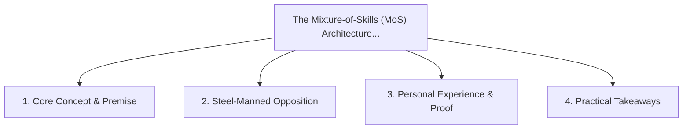

# The Mixture-of-Skills (MoS) Architecture: Dynamic Agent Specialization

<!-- prettier-ignore-start -->
<!-- markdownlint-disable MD013 -->
**Series Context**: Part 5 of the [[topics/documents/series-the-zero-dependency-web|The Zero-Dependency & Zero-Framework Web]] series.
<!-- markdownlint-restore -->
<!-- prettier-ignore-end -->

---

## 🗺️ Topic Mind Map

---

## 1. Deep-Dive Knowledge & Context

### Core Insight

Rather than paying for gigantic monolithic context windows, dynamic skill routing activates narrow
expert prompts tailored to specific models and tasks.

### Counter-Perspective (Steel-Manning)

Multi-agent handoff latency and state synchronization overhead.

### Nuances & Blind Spots

- Practical implementation edge cases when adopting this approach in production environments.
- Distinguishing between dogmatic application and context-sensitive pragmatism.

---

## 2. Evidence, Stories & Reference Vault

### Personal Anecdotes & Field Experience

- Orchestrating specialized sub-agents with narrow skill rules to write flawless targeted modules.

### Metaphors & Analogies

- **A specialized surgical team swapping tools rather than one person juggling an entire clinic.**

---

## 3. Practical Action & Takeaways

1. **First Step**: Audit existing workflows or codebases for this specific failure mode or pattern.
2. **Rule of Thumb**: Prefer explicit, decoupled, and durable implementations over transient
   convenience.
3. **Core Metric**: Reduced maintenance friction, lower cognitive load, and sustained velocity.

---

## 4. Multi-Channel Repurposing Matrix

### Medium / Substack (Focused Deep Dive)

- Narrative arc exploring the problem, field scar tissue, counter-arguments, and solution.

### BlueSky (Micro & Thread Hook)

- **Hook**: "A counter-intuitive lesson from 20+ years of engineering: Rather than paying for
  gigantic monolithic context windows, dynamic skill routing activates narrow expert prompts
  tailor... 🧵"

### YouTube / TikTok (Short & Video Vector)

- **Hook**: 60-second walkthrough centered on the metaphor: _A specialized surgical team swapping
  tools rather than one person juggling an entire clinic._.
