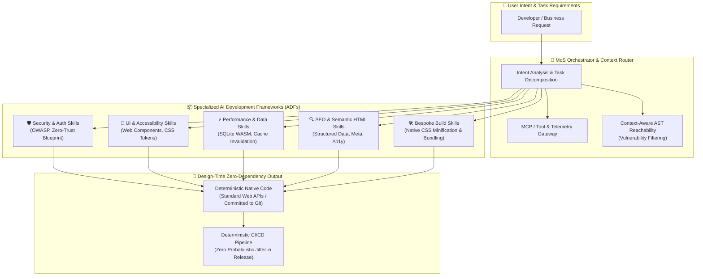

# The Mixture-of-Skills (MoS) Architecture: Dynamic Agent Specialization

<!-- prettier-ignore-start -->
<!-- markdownlint-disable MD013 -->
**Series Context**: Part 5 of the [[topics/documents/series-the-zero-dependency-web|The Zero-Dependency & Zero-Framework Web]] series.
<!-- markdownlint-restore -->
<!-- prettier-ignore-end -->

---

## 🗺️ Topic Mind Map & Architectural Flow



---

## 1. Deep-Dive Knowledge & Context

### Core Insight & Thesis

> **We used runtime frameworks because human typing and boilerplate was our historical bottleneck;
> in an AI-native world, we do not need runtime bloat—we need composable AI Development Frameworks
> (ADFs) and context engines that generate clean, zero-dependency code directly against web
> standards.**

Frameworks and heavy 3rd-party libraries were created to give human developers shortcuts: pre-baked
state machines, routing harnesses, and UI components. But they came with a massive tax:

1. **One-Size-Fits-All Bloat**: Libraries try to serve every possible edge case, forcing apps to
   carry megabytes of unused runtime code (with Chrome coverage tabs frequently showing 80%+ unused
   code).
2. **Brittle Integration Costs**: The hardest engineering work often isn't writing business logic—it
   is forcing three different frameworks with incompatible lifecycles to play nice.
3. **Rigid Lock-In & Upstream Volatility**: Upgrading or swapping a core framework demands months of
   rewrites, breaking changes, and contagious adapter layers.

With modern AI agents, the bottleneck is inverted. The AI writes code at machine speed. By feeding
the agent specialized **AI Development Frameworks (ADFs)**—the next-generation successor to the
traditional Software Development Life Cycle (SDLC), encompassing everything from scaffolding and
linting to coding conventions, testing harnesses, and build/CI orchestration—the agent generates
tailored, native code that has zero runtime dependency footprint.

---

### The Canonical ADF vs. Enterprise Methodology Hierarchy

An AI Development Framework (ADF) operates not as a monolithic runtime library, but as a
hierarchical system of governed software methodologies:

```text
┌─────────────────────────────────────────────────────────────┐
│              1. Canonical ADF (Public Standard)             │
│   (Upstream source of truth, best practices & core skills)  │
└──────────────────────────────┬──────────────────────────────┘
                               │ inherits & refines
                               ▼
┌─────────────────────────────────────────────────────────────┐
│          2. Enterprise / Org Methodology (Team Tier)        │
│    (Company architecture, security gates, design tokens)    │
└──────────────────────────────┬──────────────────────────────┘
                               │ inherits & customizes
                               ▼
┌─────────────────────────────────────────────────────────────┐
│           3. Application / Workspace Blueprint (Leaf)       │
│    (Local domain logic, bespoke state, local test suites)   │
└─────────────────────────────────────────────────────────────┘
```

1. **The Canonical ADF**: The upstream, community-maintained source of truth defining how an AI
   understands a domain (e.g. security audits, semantic web components, SQLite WASM data layers).
2. **Company / Team Methodologies**: Organizations fork or inherit from canonical ADFs to codify
   their internal standards, architectural constraints, security policies, and brand design tokens.
3. **Application Blueprints**: Individual projects apply these methodologies to write lean, bespoke
   code without ever dragging the framework down to the user's browser runtime.

---

### Key Architectural Inversions Surfaced in Technical Grilling

#### 1. Design-Time Generation vs. Build-Time Magic (CI/CD Determinism)

- **The Misconception**: Opponents assume an AI generates code on every CI build, introducing
  probabilistic jitter into production releases.
- **The Reality**: AI acts strictly at **design and authoring time**. The code emitted is static,
  auditable, deterministic TypeScript/JavaScript committed directly to version control. CI/CD
  remains completely boring, repeatable, and deterministic.

#### 2. The Upgrade Inversion: Decoupling Intelligence from Production Code

- **Traditional NPM Upgrades**: Bumping a version is an all-or-nothing gamble that touches
  production code immediately, demanding extensive regression testing and risking breaking changes.
- **MoS / ADF Upgrades**: Updating an ADF skill package modifies **zero lines of production code**.
  It simply upgrades the intelligence of the assistant auditing the repository. The assistant
  identifies improvements as opt-in code suggestions rather than forced breaking changes.

#### 3. The Engineer's Evolving Role: From Boilerplate Typist to Editor-in-Chief

- Software engineering shifts from low-level manual plumbing to **high-level verification, prompt
  architecture, and skill curation**.
- When an engineer identifies a subtle bug or anti-pattern during code review, they don't just patch
  the line—they codify the fix into an updated local or team skill so the entire organization never
  makes that mistake again.

#### 4. The Historical Precedent: The Assembly to 3GL Transition

- When programming shifted from Assembly to third-generation languages (C, Fortran), critics argued
  that developers would lose hardware understanding and create bloated binaries.
- Moving from rigid monolithic frameworks to AI-directed web standards is the next natural step in
  the ladder of abstraction: human intent dictates the architecture, while machines handle the
  syntactic scaffolding.

---

### Counter-Perspective & Intellectual Steel-Manning

#### The Primary Objections & Answers

1. **The Snowflake Codebase Fear**:
   - _Objection_: _"Won't bespoke code make every codebase an idiosyncratic snowflake?"_
   - _Defense_: Standard Web APIs (Web Components, CSS Custom Properties, Fetch, ECMAScript) provide
     a timeless, universal vocabulary that outlasts proprietary framework APIs that change every 18
     months. Shared Skill Registries ensure team-wide consistency.
2. **The "Who Tests the Tests?" Paradox**:
   - _Objection_: _"If AI writes the code and the tests, won't it duplicate its own blind spots?"_
   - _Defense_: Testing shifts to strict **Test-Driven Development (TDD)** and **Fitness Functions**
     where human engineers write or strictly review assertions first, forcing the agent into
     adversarial, organic code generation until tests pass under strict constraint validation.
3. **Context-Aware Reachability vs. Dumb CVE Scanning**:
   - _Defense_: Instead of waking engineers up for CVEs in dormant code, an MoS orchestrator
     evaluates actual AST call-graph reachability, notifying developers only when an active
     execution path is at risk.

---

### Concession Boundaries & Unresolved Frontiers

#### When Pre-Built Packages Still Make Complete Sense

- **Cryptographic Primitives & Constant-Time Math**: (e.g., `libsodium`) where manual generation
  risks catastrophic security flaws.
- **Compiled WASM Engines & Binary Parsers**: (e.g., SQLite WASM, video transcoders).
- **Official Enterprise SDKs**: Direct vendor integration endpoints (e.g., AWS SDK, Stripe SDK).

#### The Unresolved Frontiers (The Honest Edge)

- **The Model Portability Dilemma**: A skill prompt optimized for Claude 3.7 might behave
  differently in Gemini 3.7 or GPT-5. Frameworks in the AI era may require model-specific adapter
  tuning.
- **The Post-Labor Open-Source Economy**: As AI decouples code generation from doc-site traffic and
  sponsorships (e.g., Tailwind layoffs), new economic models for compensating skill creators must
  emerge.

---

## 2. Evidence, Stories & Reference Vault

### Lived Career War Stories

- **[[topics/stories/the-snippet-era|The Snippet Era: Self-Written Code, Forums, and the Pre-NPM
    Web]]**: Before external runtime packages existed, frontend developers wrote their own code,
    shared evaluated snippets on early forums, and upheld the ironclad rule of reading and vetting
    every line before taking local ownership.
- **[[topics/stories/the-rise-of-frameworks|The Rise of Frameworks: Taming the Wild West of
    Frontend Chaos]]**: As apps grew, the lack of architectural structure turned frontend onboarding
    into an unbearable nightmare. Frameworks drew a line in the sand to enforce structure—solving a
    human coordination problem that AI Development Frameworks (ADFs) now resolve at design time.
- **The Enterprise Upgrade Nightmare**: Spending 6+ months migrating enterprise suites across
  breaking major framework versions (e.g., AngularJS to Angular 2+, or React class to hook
  paradigms), where 80% of developer hours were spent on framework churn rather than customer value.
- **The Adapter Pattern Tax**: Building elaborate wrapper and adapter layers around 3rd-party UI
  kits just to shield business logic from upstream breaking changes—accumulating accidental
  complexity purely to appease framework dependencies.

### Master Physical Metaphor

> **The 50-Pound Swiss Army Knife vs. The Master Craftsman's Modular Tool Belt**
>
> A monolithic framework is like a 50-pound Swiss Army knife. It has a magnifying glass, saw, and
> fish scaler you will never use, but you must carry the entire weight in your pocket everywhere you
> go. When the blade breaks, you throw the whole tool away.
>
> The Mixture-of-Skills architecture is the Master Craftsman's Tool Belt: a lean, light belt that
> holds standard raw materials, while an apprentice fetches the exact precision chisel or jig from
> the workshop wall only at the exact moment of the cut—and hangs it back up when done.

### 🎙️ Deep-Dive Mock Interview Transcript

- **Full Discussion**: [[topics/interviews/the-mixture-of-skills-architecture|The Pragmatic
        Architect Podcast: The Mixture-of-Skills Architecture]]
- **Key Debates Covered**:
  - _Design-Time vs. Build-Time Generation_ (Why CI/CD remains 100% deterministic).
  - _The Assembly Language Parallel_ (Historical transitions from low-level control to higher
    abstractions).
  - _Context-Aware Reachability vs. Dumb CVE Scanning_ (Why AST reachability eliminates alert
    fatigue).
  - _The Greenfield Wedge_ (Strangling legacy React/Vue monoliths using wrapped zero-dependency Web
    Components).

---

## 3. Practical Architectural Blueprint

### The 4-Tier Mixture-of-Skills Stack

1. **Tier 1: Intent Orchestrator**: Analyzes user prompts, assesses required domain competencies,
   and routes requests.
2. **Tier 2: ADF / Skill Registry**: Modular Markdown/JSON skill packages (e.g. `security-audit`,
   `semantic-html`, `sqlite-wasm-cache`, `css-design-system`, `bespoke-build-minifier`).
3. **Tier 3: Context & MCP Gateway**: Live tooling, AST reachability analysis, linters, test
   harnesses, and telemetry.
4. **Tier 4: Zero-Dependency Output**: Clean, native TypeScript/JavaScript running on Node, Bun,
   Deno, or browser runtimes without external npm runtime bloat.

### The Monday Morning Experiment (The Isolated Utility Spike)

> Pick one non-critical, isolated piece of UI scheduled for your next sprint—such as an accessible
> modal or a custom dropdown—that your team would normally install an external npm package for.
>
> Instead of running `npm install`, write a small Markdown skill defining your company’s
> accessibility rules, token naming, and lifecycle cleanup. Have the agent generate a
> zero-dependency Web Component, wrap it so it mounts cleanly into your existing framework tree, and
> commit it. Measure the bundle difference, run the tests, and see if the team actually finds the
> native code easier or harder to review.

---

## 4. Multi-Channel Repurposing Matrix

### ✍️ Medium / Substack (Anchor Essay)

- **Title**: _The Mixture-of-Skills Architecture: Why AI Makes Monolithic Frameworks Obsolete_
- **Subtitle**: _We used frameworks because human typing was our bottleneck. In an AI world, we need
  modular skill registries, not runtime bloat._
- **Structure**:
  1. The 50-Pound Swiss Army Knife (The Hidden Tax of Frameworks).
  2. Why Frameworks Were Built (Human Ergonomics vs. Runtime Cost).
  3. The Inversion: Design-Time Generation & Decoupling Upgrades from Production Code.
  4. The Assembly Precedent: Why Higher Abstractions Always Win.
  5. The Architecture of a Mixture-of-Skills (MoS) System.
  6. The Snowflake Counter-Argument: Why Web Standards Win Long-Term.
  7. The Monday Morning Experiment (The Isolated Utility Spike).

### 🧵 BlueSky & LinkedIn (Micro-Post & Thread)

- **Hook**: "Frameworks were designed to save human developers from writing boilerplate. But in an
  AI world, framework lock-in is a liability, not an asset. Here is why the future belongs to
  Mixture-of-Skills (MoS) registries instead of npm dependencies 🧵👇"
- **Key Slides/Cards**:
  1. The Swiss Army Knife vs. The Tool Belt diagram.
  2. The 3 Costs of Framework Lock-In.
  3. Design-Time vs. Build-Time Generation.
  4. The 4-Tier MoS Architecture.
  5. The Monday Morning Experiment.

### 🎥 YouTube (Long-Form & Deep-Dive Script)

- **Concept**: _Stop Building With Monolithic Frameworks: The Mixture-of-Skills Paradigm_
- **Opening (0:00-0:45)**: Hold up a physical multi-tool or diagram showing 500MB `node_modules` vs.
  a lean 5KB native script.
- **Visual Walkthrough**: Interactive demo showing an AI agent loading a security skill, generating
  a zero-dependency native Web Component, and passing strict automated lints.
