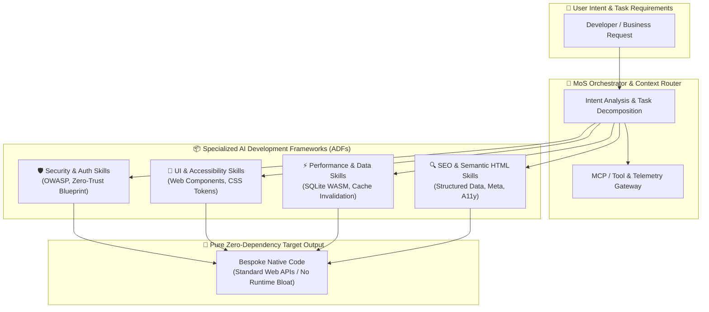

# The Mixture-of-Skills (MoS) Architecture: Dynamic Agent Specialization

<!-- prettier-ignore-start -->
<!-- markdownlint-disable MD013 -->
**Series Context**: Part 5 of the [[topics/documents/series-the-zero-dependency-web|The Zero-Dependency & Zero-Framework Web]] series.
<!-- markdownlint-restore -->
<!-- prettier-ignore-end -->

---

## 🗺️ Topic Mind Map & Architectural Flow

---

## 1. Deep-Dive Knowledge & Context

### Core Insight & Thesis

> **We used runtime frameworks because human typing and boilerplate was our historical bottleneck;
> in an AI-native world, we do not need runtime bloat—we need composable AI Skill Packages (ADFs)
> and context engines that generate clean, zero-dependency code directly against web standards.**

Frameworks and heavy 3rd-party libraries were created to give human developers shortcuts: pre-baked
state machines, routing harnesses, and UI components. But they came with a massive tax:

1. **One-Size-Fits-All Bloat**: Libraries try to serve every possible edge case, forcing apps to
   carry megabytes of unused runtime code.
2. **Brittle Integration Costs**: The hardest engineering work often isn't writing business logic—it
   is forcing three different frameworks with incompatible lifecycles to play nice.
3. **Rigid Lock-In**: Upgrading or swapping a core framework demands months of rewrites and
   contagious adapter layers.

With modern AI agents, the bottleneck is inverted. The AI writes code at machine speed. By feeding
the agent specialized **AI Development Frameworks (ADFs)**—structured domain rules, security
blueprints, and performance patterns—the agent can generate tailored, native code that has zero
runtime dependency footprint.

---

### Counter-Perspective & Intellectual Steel-Manning

#### The Primary Objection

> _"If AI writes bespoke, framework-free code for every project, won't every codebase become a
> snowflake that is impossible for human teams to maintain?"_

#### The Steel-Manned Defense

1. **Standard Web APIs as the Universal Shared Vocabulary**: Framework APIs (e.g. React hooks,
   Angular decorators) churn every few years. Native standards (HTML5, CSS Custom Properties, Fetch,
   Web Components, ECMAScript) are timeless, durable, and universally documented.
2. **Skill Blueprints Act as Unified Guardrails**: The shared consistency comes from the **Skill
   Registry** itself. If every engineer on the team uses the same curated Security, UI, and Linting
   skills, the generated code adheres to identical patterns without paying runtime tax.
3. **Elimination of the Framework Tax**: Teams gain unprecedented agility. When business
   requirements pivot, the AI regenerates the native implementation rather than fighting an
   inflexible 3rd-party library.

---

### Concession Boundaries: When Libraries Still Make Sense

Pre-built runtime packages remain essential for:

- **Cryptographic Primitives & Low-Level Math**: Where human implementation errors introduce fatal
  security vulnerabilities (e.g. `libsodium`, constant-time comparison).
- **Binary Parsers & WASM Kernels**: Highly tuned compiled engines (e.g. SQLite WASM, video codecs).
- **Official Enterprise SDKs**: Direct vendor integration endpoints (e.g. Stripe, AWS SDKs).

---

## 2. Evidence, Stories & Reference Vault

### Lived Career War Stories

- **The Enterprise Upgrade Nightmare**: Spending 6+ months migrating enterprise suites across
  breaking major framework versions (e.g., AngularJS to Angular 2+, or React class to hook
  paradigms), where 80% of developer hours were spent on framework churn rather than customer value.
- **The Adapter Pattern Tax**: Building elaborate wrapper and adapter layers around 3rd-party UI
  kits just to shield business logic from upstream breaking changes—accumulating accidental
  complexity purely to appease framework dependencies.

### Master Physical Metaphor

> **The 50-Pound Swiss Army Knife vs. The Master Craftsman's Modular Tool Belt**
>
> A monolithic framework is like a 50-pound Swiss Army knife. It has a magnifying glass, saw, and
> fish scaler you will never use, but you must carry the entire weight in your pocket everywhere you
> go. When the blade breaks, you throw the whole tool away.
>
> The Mixture-of-Skills architecture is the Master Craftsman's Tool Belt: a lean, light belt that
> holds standard raw materials, while an apprentice fetches the exact precision chisel or jig from
> the workshop wall only at the exact moment of the cut—and hangs it back up when done.

### 🎙️ Deep-Dive Mock Interview Transcript

- **Full Discussion**: [[topics/interviews/the-mixture-of-skills-architecture|The Pragmatic
        Architect Podcast: The Mixture-of-Skills Architecture]]
- **Key Debates Covered**:
  - _Design-Time vs. Build-Time Generation_ (Why CI/CD remains 100% deterministic).
  - _The Assembly Language Parallel_ (Historical transitions from low-level control to higher
    abstractions).
  - _Context-Aware Reachability vs. Dumb CVE Scanning_ (Why AST reachability eliminates alert
    fatigue).
  - _The Greenfield Wedge_ (Strangling legacy React/Vue monoliths using wrapped zero-dependency Web
    Components).

---

## 3. Practical Architectural Blueprint

### The 4-Tier Mixture-of-Skills Stack

1. **Tier 1: Intent Orchestrator**: Analyzes user prompts and determines required domain
   competencies.
2. **Tier 2: ADF / Skill Registry**: Modular Markdown/JSON skill packages (e.g. `security-audit`,
   `semantic-html`, `sqlite-wasm-cache`, `css-design-system`).
3. **Tier 3: Context & MCP Gateway**: Live tooling, linters, test harnesses, and telemetry.
4. **Tier 4: Zero-Dependency Output**: Clean, native TypeScript/JavaScript running on Node, Bun,
   Deno, or browser runtimes without external npm runtime bloat.

---

## 4. Multi-Channel Repurposing Matrix

### ✍️ Medium / Substack (Anchor Essay)

- **Title**: _The Mixture-of-Skills Architecture: Why AI Makes Monolithic Frameworks Obsolete_
- **Subtitle**: _We used frameworks because human typing was our bottleneck. In an AI world, we need
  modular skill registries, not runtime bloat._
- **Structure**:
  1. The 50-Pound Swiss Army Knife (The Hidden Tax of Frameworks).
  2. Why Frameworks Were Built (Human Ergonomics vs. Runtime Cost).
  3. The Inversion: How AI Changes the Rapid Application Development Equation.
  4. The Architecture of a Mixture-of-Skills (MoS) System.
  5. The Snowflake Counter-Argument: Why Web Standards Win Long-Term.
  6. The 4-Tier Blueprint for Modern Engineering Teams.

### 🧵 BlueSky & LinkedIn (Micro-Post & Thread)

- **Hook**: "Frameworks were designed to save human developers from writing boilerplate. But in an
  AI world, framework lock-in is a liability, not an asset. Here is why the future belongs to
  Mixture-of-Skills (MoS) registries instead of npm dependencies 🧵👇"
- **Key Slides/Cards**:
  1. The Swiss Army Knife vs. The Tool Belt diagram.
  2. The 3 Costs of Framework Lock-In.
  3. The 4-Tier MoS Architecture.
  4. Concessions: When libraries still matter (Crypto/WASM).

### 🎥 YouTube (Long-Form & Deep-Dive Script)

- **Concept**: _Stop Building With Monolithic Frameworks: The Mixture-of-Skills Paradigm_
- **Opening (0:00-0:45)**: Hold up a physical multi-tool or diagram showing 500MB `node_modules` vs.
  a lean 5KB native script.
- **Visual Walkthrough**: Interactive demo showing an AI agent loading a security skill, generating
  a zero-dependency native Web Component, and passing strict automated lints.
