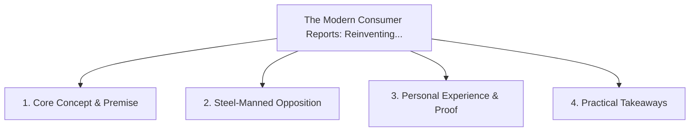

# The Modern Consumer Reports: Reinventing Investigative Advocacy for the AI Era

<!-- prettier-ignore-start -->
<!-- markdownlint-disable MD013 -->
**Series Context**: Part 3 of the [[topics/documents/series-the-anti-surveillance-consumer|The Anti-Surveillance Consumer & Algorithmic Transparency]] series.
<!-- markdownlint-restore -->
<!-- prettier-ignore-end -->

---

## 🗺️ Topic Mind Map

---

## 1. Deep-Dive Knowledge & Context

### Core Insight

The 1980s investigative journalism model of Consumer Reports must be reborn as real-time, automated
data exposes against corporate dark patterns.

### Counter-Perspective (Steel-Manning)

Traditional lab testing evaluated physical safety and durability, which requires expensive physical
labs.

### Nuances & Blind Spots

- Practical implementation edge cases when adopting this approach in production environments.
- Distinguishing between dogmatic application and context-sensitive pragmatism.

---

## 2. Evidence, Stories & Reference Vault

### Personal Anecdotes & Field Experience

- Remembering childhood Consumer Reports magazines exposing false advertising and unsafe appliances.

### Metaphors & Analogies

- **Upgrading from a monthly printed consumer bulletin to a live radar detection screen.**

---

## 3. Practical Action & Takeaways

1. **First Step**: Audit existing workflows or codebases for this specific failure mode or pattern.
2. **Rule of Thumb**: Prefer explicit, decoupled, and durable implementations over transient
   convenience.
3. **Core Metric**: Reduced maintenance friction, lower cognitive load, and sustained velocity.

---

## 4. Multi-Channel Repurposing Matrix

### Medium / Substack (Focused Deep Dive)

- Narrative arc exploring the problem, field scar tissue, counter-arguments, and solution.

### BlueSky (Micro & Thread Hook)

- **Hook**: "A counter-intuitive lesson from 20+ years of engineering: The 1980s investigative
  journalism model of Consumer Reports must be reborn as real-time, automated data exposes
  against... 🧵"

### YouTube / TikTok (Short & Video Vector)

- **Hook**: 60-second walkthrough centered on the metaphor: _Upgrading from a monthly printed
  consumer bulletin to a live radar detection screen._.
