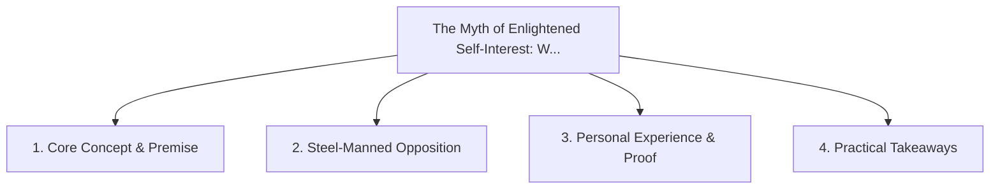

# The Myth of Enlightened Self-Interest: Why the 'Invisible Hand' Is Broken

<!-- prettier-ignore-start -->
<!-- markdownlint-disable MD013 -->
**Series Context**: Part 1 of the [[topics/documents/series-the-evolution-beyond-extractive-capitalism|The Evolution Beyond Extractive Capitalism & The Myth of Self-Interest]] series.
<!-- markdownlint-restore -->
<!-- prettier-ignore-end -->

---

## 🗺️ Topic Mind Map

---

## 1. Deep-Dive Knowledge & Context

### Core Insight

When corporate structures insulate decision-makers from the societal harm of their choices,
self-interest leads to pure extraction rather than collective wealth.

### Counter-Perspective (Steel-Manning)

Enlightened self-interest correctly aligns customer satisfaction with long-term brand equity in
competitive markets.

### Nuances & Blind Spots

- Practical implementation edge cases when adopting this approach in production environments.
- Distinguishing between dogmatic application and context-sensitive pragmatism.

---

## 2. Evidence, Stories & Reference Vault

### Personal Anecdotes & Field Experience

- Observing companies deliberately degrade product quality once monopoly lock-in is achieved.

### Metaphors & Analogies

- **A fisherman using dynamite in a shared lake: maximum catch today, a dead ecosystem tomorrow.**

---

## 3. Practical Action & Takeaways

1. **First Step**: Audit existing workflows or codebases for this specific failure mode or pattern.
2. **Rule of Thumb**: Prefer explicit, decoupled, and durable implementations over transient
   convenience.
3. **Core Metric**: Reduced maintenance friction, lower cognitive load, and sustained velocity.

---

## 4. Multi-Channel Repurposing Matrix

### Medium / Substack (Focused Deep Dive)

- Narrative arc exploring the problem, field scar tissue, counter-arguments, and solution.

### BlueSky (Micro & Thread Hook)

- **Hook**: "A counter-intuitive lesson from 20+ years of engineering: When corporate structures
  insulate decision-makers from the societal harm of their choices, self-interest leads to pure ...
  🧵"

### YouTube / TikTok (Short & Video Vector)

- **Hook**: 60-second walkthrough centered on the metaphor: _A fisherman using dynamite in a shared
  lake: maximum catch today, a dead ecosystem tomorrow._.
