# The Myth of Specialization: Jack of All Trades, Master of Adaptability

## 🗺️ Topic Mind Map

```mermaid
graph TD
    SPEC["The Myth of Specialization"]

    %% Branches
    SPEC --> QUOTE["1. The Truncated Proverb"]
    SPEC --> T_SHAPED["2. T-Shaped & Comb-Shaped Engineers"]
    SPEC --> AI_ERA["3. The Generalist Renaissance in the AI Era"]
    SPEC --> STEELMAN["4. Counter-Perspective: Value of Deep Specialists"]
    SPEC --> REPURPOSE["5. Multi-Channel Distribution"]

    %% Quote
    QUOTE --> TRUNCATED["Common: 'Jack of all trades, master of none'"]
    QUOTE --> COMPLETE["Original: '...but ofttimes better than a master of one'"]

    %% T-Shaped
    T_SHAPED --> SYNTHESIS["Cross-domain synthesis: Connecting database locks to UI state"]
    T_SHAPED --> LATERAL["Learning the 20% difference by analogy rather than starting from zero"]

    %% AI Era
    AI_ERA --> COMMODITY["AI commoditizes narrow syntax expertise"]
    AI_ERA --> SYSTEM_VIEW["System-level orchestrators and architects become high-leverage"]

    %% Steelman
    STEELMAN --> DEEP_DOMAINS["Compilers, database kernels, cryptography require hyper-specialization"]
    STEELMAN --> ENTERPRISE_ROLES["Large enterprises hire for narrow immediate job requisitions"]

    %% Repurpose
    REPURPOSE --> MED["Medium: Career & Architectural Essay"]
    REPURPOSE --> BS["BlueSky: Contrarian Career Thread"]
    REPURPOSE --> YT["YouTube: Thoughtful Perspective Video"]
```

---

## 1. Core Thesis & Nuance

### The Core Premise
The popular proverb is routinely truncated to discourage broad learning: people say *"Jack of all trades, master of none"* to imply weakness. The full historical couplet is: *"A jack of all trades is a master of none, but ofttimes better than a master of one."* In modern software architecture and systems engineering, generalists who understand the whole stack (database indexing, backend event loops, network latencies, browser rendering, and human UX) are the ones who design resilient systems and prevent catastrophic integration failures.

### The Counter-Perspective (Steel-Manning Hyper-Specialization)
1. **Kernel & Frontier Engineering**: Building a database engine, an operating system kernel, or cryptographic primitives requires years of relentless, narrow specialization.
2. **Enterprise Hiring Funnels**: Resumes tailored to exact keyword niches ("Senior React performance specialist") often pass corporate ATS filters faster than broad "Principal Problem Solver" resumes.

### Blind Spots & Nuances
- Generalism without depth in at least one or two core domains risks becoming shallow; the sweet spot is "T-shaped" or "Comb-shaped" engineering.

---

## 2. Evidence & Story Bank

### Personal Anecdotes
- Solving complex performance bottlenecks in minutes because of understanding both SQL query execution plans and frontend event delegation, where specialized teams spent weeks pointing fingers at each other.
- The power of learning by analogy: learning a new technology by identifying the 20% diff from an existing system rather than relearning 80% from scratch.

### Metaphors & Analogies
- **The Decathlete vs. The 100m Sprinter**: The sprinter wins the gold in a straight 100m dash on a flat track. But software architecture is not a flat track—it's an obstacle course through mud, mountains, and rivers. The decathlete finishes the race every time.

---

## 3. Multi-Channel Repurposing Matrix

### Medium (Anchor Essay)
- **Title**: *The Myth of Specialization: Why the Jack of All Trades is Winning the Future of Tech*
- **Sections**:
  1. The Missing Half of the Proverb.
  2. The Danger of the Single-Discipline Silo.
  3. Learning the 20% Diff: How Generalists Master New Tech at Light Speed.
  4. Why AI Makes the System Architect More Valuable Than the Syntax Specialist.

### BlueSky (Thread)
- **Hook**: "Everyone knows the quote 'Jack of all trades, master of none.' Almost nobody knows how it actually ends: '...but ofttimes better than a master of one.' Here is why generalists build the best software systems: 🧵"

---

## 4. Interactive Discussion Prompt
> *"Are you a generalist or a specialist? What was a moment in your career where your broad knowledge saved a project that a narrow specialist was stuck on?"*
