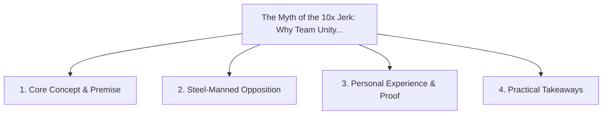

# The Myth of the 10x Jerk: Why Team Unity Always Outperforms Isolated Genius

<!-- prettier-ignore-start -->
<!-- markdownlint-disable MD013 -->
**Series Context**: Part 2 of the [[topics/documents/series-workplace-unity-and-consultation|Workplace Unity, Consultation & Blameless Culture]] series.
<!-- markdownlint-restore -->
<!-- prettier-ignore-end -->

---

## 🗺️ Topic Mind Map

---

## 1. Deep-Dive Knowledge & Context

### Core Insight

A toxic high-performer creates systemic negative externalities—fear, turnover, withheld
information—that easily erase their individual output.

### Counter-Perspective (Steel-Manning)

Certain extreme solo greenfield breakthroughs historically came from difficult, uncompromising
individuals.

### Nuances & Blind Spots

- Practical implementation edge cases when adopting this approach in production environments.
- Distinguishing between dogmatic application and context-sensitive pragmatism.

---

## 2. Evidence, Stories & Reference Vault

### Personal Anecdotes & Field Experience

- Seeing an entire 8-person engineering team quietly disengage because of one aggressive senior
  architect.

### Metaphors & Analogies

- **A brilliant engine that vibrates so violently it shakes the entire chassis apart.**

---

## 3. Practical Action & Takeaways

1. **First Step**: Audit existing workflows or codebases for this specific failure mode or pattern.
2. **Rule of Thumb**: Prefer explicit, decoupled, and durable implementations over transient
   convenience.
3. **Core Metric**: Reduced maintenance friction, lower cognitive load, and sustained velocity.

---

## 4. Multi-Channel Repurposing Matrix

### Medium / Substack (Focused Deep Dive)

- Narrative arc exploring the problem, field scar tissue, counter-arguments, and solution.

### BlueSky (Micro & Thread Hook)

- **Hook**: "A counter-intuitive lesson from 20+ years of engineering: A toxic high-performer
  creates systemic negative externalities—fear, turnover, withheld information—that easily erase
  th... 🧵"

### YouTube / TikTok (Short & Video Vector)

- **Hook**: 60-second walkthrough centered on the metaphor: _A brilliant engine that vibrates so
  violently it shakes the entire chassis apart._.
