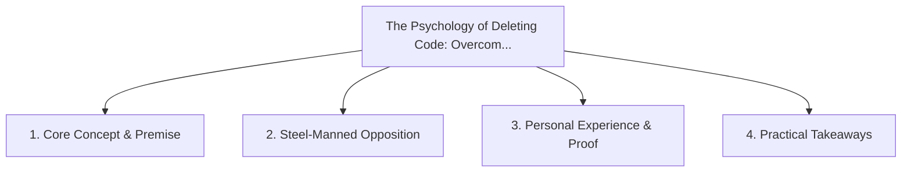

# The Psychology of Deleting Code: Overcoming the Fear of the Backspace Key

<!-- prettier-ignore-start -->
<!-- markdownlint-disable MD013 -->
**Series Context**: Part 1 of the [[topics/documents/series-the-automated-code-pruner|The Automated Code Pruner & Dead Baggage Purge]] series.
<!-- markdownlint-restore -->
<!-- prettier-ignore-end -->

---

## 🗺️ Topic Mind Map

---

## 1. Deep-Dive Knowledge & Context

### Core Insight

Engineers suffer from sunk-cost fallacy regarding legacy code; real architectural maturity is
celebrated by lines removed, not lines added.

### Counter-Perspective (Steel-Manning)

Old code often embeds subtle bug fixes that are not documented in unit tests.

### Nuances & Blind Spots

- Practical implementation edge cases when adopting this approach in production environments.
- Distinguishing between dogmatic application and context-sensitive pragmatism.

---

## 2. Evidence, Stories & Reference Vault

### Personal Anecdotes & Field Experience

- Working with senior engineers who defended 5-year-old orphaned helper scripts out of emotional
  attachment.

### Metaphors & Analogies

- **Hoarding old furniture in a hallway because 'we might need to sit down there one day.'**

---

## 3. Practical Action & Takeaways

1. **First Step**: Audit existing workflows or codebases for this specific failure mode or pattern.
2. **Rule of Thumb**: Prefer explicit, decoupled, and durable implementations over transient
   convenience.
3. **Core Metric**: Reduced maintenance friction, lower cognitive load, and sustained velocity.

---

## 4. Multi-Channel Repurposing Matrix

### Medium / Substack (Focused Deep Dive)

- Narrative arc exploring the problem, field scar tissue, counter-arguments, and solution.

### BlueSky (Micro & Thread Hook)

- **Hook**: "A counter-intuitive lesson from 20+ years of engineering: Engineers suffer from
  sunk-cost fallacy regarding legacy code; real architectural maturity is celebrated by lines
  remove... 🧵"

### YouTube / TikTok (Short & Video Vector)

- **Hook**: 60-second walkthrough centered on the metaphor: _Hoarding old furniture in a hallway
  because 'we might need to sit down there one day.'_.
