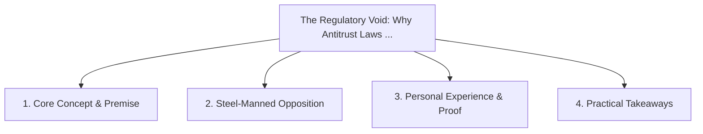

# The Regulatory Void: Why Antitrust Laws Fail at Micro-Targeted Extraction

<!-- prettier-ignore-start -->
<!-- markdownlint-disable MD013 -->
**Series Context**: Part 6 of the [[topics/documents/series-the-anti-surveillance-consumer|The Anti-Surveillance Consumer & Algorithmic Transparency]] series.
<!-- markdownlint-restore -->
<!-- prettier-ignore-end -->

---

## 🗺️ Topic Mind Map

---

## 1. Deep-Dive Knowledge & Context

### Core Insight

Current antitrust framework focuses on broad price-fixing between competitors, completely missing
personalized algorithmic rent extraction.

### Counter-Perspective (Steel-Manning)

Regulating pricing algorithms directly could distort healthy supply/demand market clearing.

### Nuances & Blind Spots

- Practical implementation edge cases when adopting this approach in production environments.
- Distinguishing between dogmatic application and context-sensitive pragmatism.

---

## 2. Evidence, Stories & Reference Vault

### Personal Anecdotes & Field Experience

- Reading FTC hearings on algorithmic pricing while companies deploy live dynamic models daily.

### Metaphors & Analogies

- **Using 19th-century maritime speed laws to regulate hypersonic drones.**

---

## 3. Practical Action & Takeaways

1. **First Step**: Audit existing workflows or codebases for this specific failure mode or pattern.
2. **Rule of Thumb**: Prefer explicit, decoupled, and durable implementations over transient
   convenience.
3. **Core Metric**: Reduced maintenance friction, lower cognitive load, and sustained velocity.

---

## 4. Multi-Channel Repurposing Matrix

### Medium / Substack (Focused Deep Dive)

- Narrative arc exploring the problem, field scar tissue, counter-arguments, and solution.

### BlueSky (Micro & Thread Hook)

- **Hook**: "A counter-intuitive lesson from 20+ years of engineering: Current antitrust framework
  focuses on broad price-fixing between competitors, completely missing personalized algorithm...
  🧵"

### YouTube / TikTok (Short & Video Vector)

- **Hook**: 60-second walkthrough centered on the metaphor: _Using 19th-century maritime speed laws
  to regulate hypersonic drones._.
