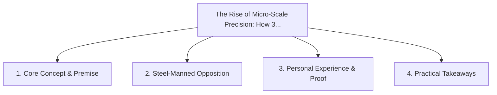

# The Rise of Micro-Scale Precision: How 3D Printing and Local Fab Win

<!-- prettier-ignore-start -->
<!-- markdownlint-disable MD013 -->
**Series Context**: Part 2 of the [[topics/documents/series-post-mass-production-economy|The Post-Mass Production Economy & Local Precision]] series.
<!-- markdownlint-restore -->
<!-- prettier-ignore-end -->

---

## 🗺️ Topic Mind Map

---

## 1. Deep-Dive Knowledge & Context

### Core Insight

High-precision additive manufacturing enables zero-tooling production, making custom one-off parts
as cheap as bulk-molded copies.

### Counter-Perspective (Steel-Manning)

Material strength, surface finish, and throughput of 3D printing still lag injection molding for
high volumes.

### Nuances & Blind Spots

- Practical implementation edge cases when adopting this approach in production environments.
- Distinguishing between dogmatic application and context-sensitive pragmatism.

---

## 2. Evidence, Stories & Reference Vault

### Personal Anecdotes & Field Experience

- Customizing an ergonomic keyboard housing to the millimeter of my hand geometry for under $30.

### Metaphors & Analogies

- **A sculptor shaping clay on demand vs a factory pressing cookie dough with one metal stamp.**

---

## 3. Practical Action & Takeaways

1. **First Step**: Audit existing workflows or codebases for this specific failure mode or pattern.
2. **Rule of Thumb**: Prefer explicit, decoupled, and durable implementations over transient
   convenience.
3. **Core Metric**: Reduced maintenance friction, lower cognitive load, and sustained velocity.

---

## 4. Multi-Channel Repurposing Matrix

### Medium / Substack (Focused Deep Dive)

- Narrative arc exploring the problem, field scar tissue, counter-arguments, and solution.

### BlueSky (Micro & Thread Hook)

- **Hook**: "A counter-intuitive lesson from 20+ years of engineering: High-precision additive
  manufacturing enables zero-tooling production, making custom one-off parts as cheap as
  bulk-mold... 🧵"

### YouTube / TikTok (Short & Video Vector)

- **Hook**: 60-second walkthrough centered on the metaphor: _A sculptor shaping clay on demand vs a
  factory pressing cookie dough with one metal stamp._.
