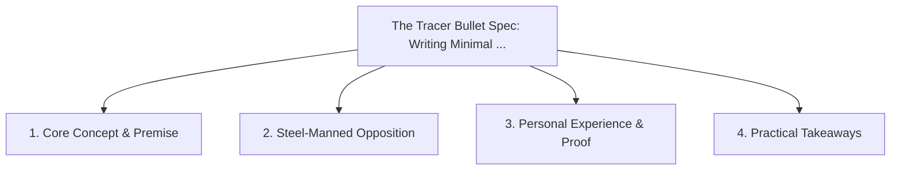

# The Tracer Bullet Spec: Writing Minimal Requirements for AI Execution

<!-- prettier-ignore-start -->
<!-- markdownlint-disable MD013 -->
**Series Context**: Part 4 of the [[topics/documents/series-living-requirements-ai-traceability|Living Requirements & End-to-End AI Traceability]] series.
<!-- markdownlint-restore -->
<!-- prettier-ignore-end -->

---

## 🗺️ Topic Mind Map

---

## 1. Deep-Dive Knowledge & Context

### Core Insight

Writing thin, end-to-end vertical slice specifications allows AI agents to build and verify working
functionality with zero ambiguity.

### Counter-Perspective (Steel-Manning)

Vertical slices can result in temporary duplicated schema migrations before full consolidation.

### Nuances & Blind Spots

- Practical implementation edge cases when adopting this approach in production environments.
- Distinguishing between dogmatic application and context-sensitive pragmatism.

---

## 2. Evidence, Stories & Reference Vault

### Personal Anecdotes & Field Experience

- Reframing a 40-page technical spec into 6 crisp tracer bullets that were implemented in days.

### Metaphors & Analogies

- **Firing an illuminated bullet to verify the trajectory before launching the main payload.**

---

## 3. Practical Action & Takeaways

1. **First Step**: Audit existing workflows or codebases for this specific failure mode or pattern.
2. **Rule of Thumb**: Prefer explicit, decoupled, and durable implementations over transient
   convenience.
3. **Core Metric**: Reduced maintenance friction, lower cognitive load, and sustained velocity.

---

## 4. Multi-Channel Repurposing Matrix

### Medium / Substack (Focused Deep Dive)

- Narrative arc exploring the problem, field scar tissue, counter-arguments, and solution.

### BlueSky (Micro & Thread Hook)

- **Hook**: "A counter-intuitive lesson from 20+ years of engineering: Writing thin, end-to-end
  vertical slice specifications allows AI agents to build and verify working functionality with z...
  🧵"

### YouTube / TikTok (Short & Video Vector)

- **Hook**: 60-second walkthrough centered on the metaphor: _Firing an illuminated bullet to verify
  the trajectory before launching the main payload._.
