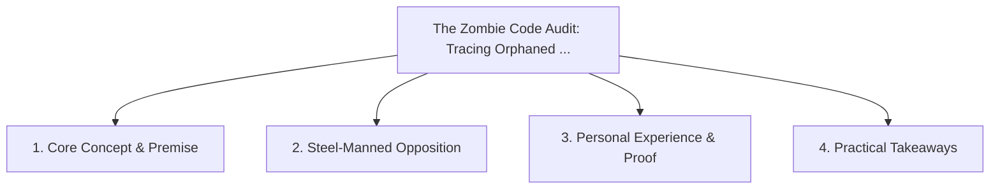

# The Zombie Code Audit: Tracing Orphaned Helpers, Routes, and Schemas with AI

<!-- prettier-ignore-start -->
<!-- markdownlint-disable MD013 -->
**Series Context**: Part 2 of the [[topics/documents/series-the-automated-code-pruner|The Automated Code Pruner & Dead Baggage Purge]] series.
<!-- markdownlint-restore -->
<!-- prettier-ignore-end -->

---

## 🗺️ Topic Mind Map

---

## 1. Deep-Dive Knowledge & Context

### Core Insight

Static AST analysis combined with semantic LLM inspection can trace full call graphs to identify
zombie modules that dead-end in production.

### Counter-Perspective (Steel-Manning)

Dynamic string-based event dispatching can disguise live call sites from AST parsers.

### Nuances & Blind Spots

- Practical implementation edge cases when adopting this approach in production environments.
- Distinguishing between dogmatic application and context-sensitive pragmatism.

---

## 2. Evidence, Stories & Reference Vault

### Personal Anecdotes & Field Experience

- Discovering 14 database columns and 6 background workers supporting a feature cancelled 3 years
  prior.

### Metaphors & Analogies

- **A power grid audit finding live high-voltage wires connecting to an abandoned lot.**

---

## 3. Practical Action & Takeaways

1. **First Step**: Audit existing workflows or codebases for this specific failure mode or pattern.
2. **Rule of Thumb**: Prefer explicit, decoupled, and durable implementations over transient
   convenience.
3. **Core Metric**: Reduced maintenance friction, lower cognitive load, and sustained velocity.

---

## 4. Multi-Channel Repurposing Matrix

### Medium / Substack (Focused Deep Dive)

- Narrative arc exploring the problem, field scar tissue, counter-arguments, and solution.

### BlueSky (Micro & Thread Hook)

- **Hook**: "A counter-intuitive lesson from 20+ years of engineering: Static AST analysis combined
  with semantic LLM inspection can trace full call graphs to identify zombie modules that dea... 🧵"

### YouTube / TikTok (Short & Video Vector)

- **Hook**: 60-second walkthrough centered on the metaphor: _A power grid audit finding live
  high-voltage wires connecting to an abandoned lot._.
