# Therapy as Preventive Maintenance: Why You Should Go Before You "Need" It

## 🗺️ Topic Mind Map

```mermaid
graph TD
    THERAPY["Therapy as Preventive Maintenance"]

    %% Branches
    THERAPY --> STIGMA["1. The Crisis-Only Stigma"]
    THERAPY --> CALIBRATION["2. Therapy as Calibration & Tooling"]
    THERAPY --> ANALYTICAL["3. The Analytical Mind in Therapy"]
    THERAPY --> STEELMAN["4. Counter-Perspective & Barriers"]
    THERAPY --> REPURPOSE["5. Multi-Channel Storytelling"]

    %% Stigma
    STIGMA --> EMERGENCY["Treating therapy like the emergency room instead of oil changes"]
    STIGMA --> SHAME["The unspoken shame: 'I should be able to figure this out alone'"]

    %% Calibration
    CALIBRATION --> MIRROR["An objective sounding board outside your social circle"]
    CALIBRATION --> BLIND_SPOTS["Uncovering subconscious cognitive loops before they cause crisis"]

    %% Analytical
    ANALYTICAL --> INTELLECT_DEFENSE["Using intellect as a shield to avoid feeling emotions"]
    ANALYTICAL --> BODY_AWARENESS["Learning to translate cognitive insights into felt emotional experiences"]

    %% Steelman
    STEELMAN --> COST["Financial cost and accessibility barriers"]
    STEELMAN --> BAD_FIT["The real frustration of bad therapist matches"]

    %% Repurpose
    REPURPOSE --> MED["Medium: Personal & Practical Narrative"]
    REPURPOSE --> BS["BlueSky: 4-Post Gentle Reflection"]
    REPURPOSE --> YT["YouTube: Thoughtful Talking-Head Reflection"]
```

---

## 1. Core Thesis & Nuance

### The Core Premise
Most people treat therapy the way they treat the hospital emergency room: you only go when something is catastrophically broken, bleeding, or on fire. But in engineering, manufacturing, and health, the most effective systems rely on *preventive maintenance*. Going to therapy when your life is relatively calm allows you to build self-awareness, unpack cognitive defense mechanisms, and calibrate your emotional compass before high-stress crises force your hand.

### The Counter-Perspective (Steel-Manning Objections)
1. **Financial & Time Barriers**: High-quality mental healthcare is often expensive and poorly covered by insurance, making regular "maintenance" a luxury for many.
2. **Bad Therapist Match Risk**: Finding the right practitioner requires trial and error, and a bad fit can set emotional progress back or feel like wasted money.
3. **Over-Pathologizing Normal Life**: There is a risk of analyzing every normal human fluctuation rather than simply living and accepting natural ups and downs.

### Blind Spots & Nuances
- The intellectual defense trap: Highly analytical thinkers (engineers, architects) often use therapy to *intellectualize* their feelings rather than actually *feel* them.

---

## 2. Evidence & Story Bank

### Personal Anecdotes
- Overcoming the hesitation to seek guidance when things were "fine" and discovering deeper blind spots in emotional reactivity and relationship patterns.
- Experiencing the difference between analyzing an emotion from 30,000 feet vs. feeling it grounded in the body.

### Metaphors & Analogies
- **The Oil Change**: You don’t wait for your car's engine to seize on the highway before you change the oil. A 45-minute oil change every few months prevents a $10,000 engine replacement. Therapy is preventive engine maintenance for the psyche.

---

## 3. Multi-Channel Repurposing Matrix

### Medium (Anchor Essay)
- **Title**: *Therapy as Preventive Maintenance: Why Waiting Until You’re Broken is the Worst Time to Start*
- **Sections**:
  1. The Emergency Room Mentality of Modern Mental Health.
  2. Why Smart, Analytical People Struggle Most with Therapy.
  3. The Difference Between Cognitive Understanding and Emotional Healing.
  4. The Practical Guide to Finding a Preventative Practitioner.

### BlueSky (Thread)
- **Hook**: "If you only take your car to the mechanic when the engine explodes on the highway, everyone calls you reckless. So why do we treat our mental health the exact same way? Here is why preventive therapy changed how I live: 🧵"

---

## 4. Interactive Discussion Prompt
> *"What was a belief about therapy you held that was completely shattered once you actually sat down with a great therapist?"*
