# Understanding vs. Feeling Love: Breaking Out of the Intellectual Trap

## 🗺️ Topic Mind Map

```mermaid
graph TD
    LOVE["Understanding vs Feeling Love"]

    %% Branches
    LOVE --> INTELLECT_TRAP["1. The Intellectual Trap"]
    LOVE --> EMBODIMENT["2. From Knowing to Feeling"]
    LOVE --> STORYTELLING["3. Storytelling as the Bridge"]
    LOVE --> STEELMAN["4. Counter-Perspective & Fear of Vulnerability"]
    LOVE --> REPURPOSE["5. Multi-Channel Distribution"]

    %% Intellect
    INTELLECT_TRAP --> CATEGORIZE["Analyzing definitions of love (Agape, Philia, Eros)"]
    INTELLECT_TRAP --> SAFETYSHELL["Intellect as an emotional armor against rejection"]

    %% Embodiment
    EMBODIMENT --> SOMATIC["Experiencing the physical warmth and openness of love"]
    EMBODIMENT --> SERVICE["Virtue in action rather than virtue in thesis"]

    %% Storytelling
    STORYTELLING --> BEYOND_LOGIC["Why logic fails to inspire virtue, but story penetrates deeply"]
    STORYTELLING --> COMMUNITY["Creating reciprocal spaces where others share their lived lessons"]

    %% Steelman
    STEELMAN --> PROTECTION["Intellect protects sensitive souls from betrayal and manipulation"]
    STEELMAN --> CLARITY["Philosophical clarity prevents toxic codependency masquerading as love"]

    %% Repurpose
    REPURPOSE --> MED["Medium: Lyrical / Reflective Essay"]
    REPURPOSE --> BS["BlueSky: 3-Post Heartfelt Reflection"]
    REPURPOSE --> YT["YouTube: Storytelling Video Essay"]
```

---

## 1. Core Thesis & Nuance

### The Core Premise

It is entirely possible to write a master's thesis on love, describe every theological and
psychological nuance of agape and compassion, and yet live completely detached from the visceral,
heart-felt reality of loving and being loved. Analytical minds frequently substitute comprehension
for connection because comprehension feels safe, predictable, and controllable. Breaking out of the
analytical cage requires stepping beyond intellectual observation into vulnerable, embodied
experience—and storytelling is the bridge that carries us there.

### The Counter-Perspective (Steel-Manning Intellectual Discernment)

1. **Protection Against Manipulation**: Clear intellectual definitions of healthy love prevent
   people from falling into abusive, manipulative, or codependent dynamics that masquerade as
   "intense romance."
2. **Philosophical Grounding**: Understanding virtue conceptually gives you an anchor when emotions
   fluctuate or when love requires disciplined, unglamorous commitment.

### Blind Spots & Nuances

- Acknowledging the legitimate fear that comes with opening an analytical armor: feelings cannot be
  debugged with a debugger.

---

## 2. Evidence & Story Bank

### Personal Anecdotes

- The realization that studying spiritual texts and analyzing virtues intellectually can become a
  substitute for opening one's heart to actual, messy people.
- The transformative moments where a simple, honest story touched an emotional depth that 100
  logical arguments could never reach.

### Metaphors & Analogies

- **The Recipe vs. The Feast**: Reading the recipe book, memorizing the spices, and analyzing the
  nutritional chemistry of a meal is not eating. You can starve to death holding a three-star
  cookbook. Feeling love is sitting at the table and taking a bite.

---

## 3. Multi-Channel Repurposing Matrix

### Medium (Anchor Essay)

- **Title**: _The Recipe is Not the Meal: Why Knowing What Love Is Won't Keep You Warm_
- **Sections**:
  1. The Scholar Who Froze to Death in the Library.
  2. The Comfort and Cowardice of the Analytical Mind.
  3. The Difference Between Cognitive Virtues and Somatic Virtues.
  4. Storytelling: The Only Language the Heart Truly Understands.

### BlueSky (Thread)

- **Hook**: "You can memorize every theological and psychological definition of love and still
  starve to death emotionally. Here is why the intellect is often just a very polite bodyguard
  keeping you from feeling: 🧵"

---

## 4. Interactive Discussion Prompt

> _"When was a time in your life when a simple story changed how you felt about someone far more
> than any logical argument ever could?"_
