# What the Heck is "this"? In JavaScript & TypeScript

## Metadata
- **ID**: `TOP-002`
- **Pillar**: Pillar 1: Pragmatic Architecture
- **Status**: Outlined
- **Primary Keywords**: #JavaScript #TypeScript #Scope #FunctionalProgramming #CodeQuality #Architecture
- **Related Topics**: [[topics/cure-for-framework-fatigue.md|Cure for Framework Fatigue]], [[topics/stop-blindly-following-patterns.md|Stop Blindly Following Patterns]]
- **Target Channels**: Medium (Anchor Essay), BlueSky (Carousel / Code Breakdown), YouTube (Visual Walkthrough)

---

## 🗺️ Topic Mind Map

```mermaid
graph TD
    THIS["What the Heck is 'this'?"]
    
    %% Branches
    THIS --> CORE["1. Core Problem"]
    THIS --> LANG["2. Cross-Language Confusion"]
    THIS --> NUANCE["3. Counter-Perspectives & Nuance"]
    THIS --> ALTERNATIVES["4. Pragmatic Alternatives"]
    THIS --> CHANNELS["5. Multi-Channel Distribution"]

    %% Core Problem
    CORE --> BIND["Execution Context vs Lexical Scope"]
    CORE --> LOSS["Losing context in callbacks / event handlers"]
    CORE --> COMPLEXITY["Mental overhead of .bind(), .call(), .apply()"]

    %% Cross-Language Confusion
    LANG --> JAVA_CPP["In Java/C++: 'this' is deterministic instance pointer"]
    LANG --> JS_QUIRK["In JS: 'this' is determined by HOW function is called"]

    %% Nuances / Steel-man
    NUANCE --> PRO_THIS["Why 'this' exists: Memory efficiency via prototypes"]
    NUANCE --> CLASS_SYNTAX["ES6 class ergonomics & OO design pattern expectations"]

    %% Pragmatic Alternatives
    ALTERNATIVES --> CLOSURES["Closures & Factory Functions"]
    ALTERNATIVES --> OBJECT_ASSIGN["Object.assign & Immutable compositions"]
    ALTERNATIVES --> PURE_FUNCS["Pure functions with explicit parameters"]

    %% Distribution
    CHANNELS --> MED["Medium: Deep Architectural Essay"]
    CHANNELS --> BS["BlueSky: Code Quiz / 4-post thread"]
    CHANNELS --> YT["YouTube: Whiteboard / Live Code Demo"]
```

---

## 1. Core Thesis & Nuance

### The Core Premise
In JavaScript/TypeScript, `this` is one of the most consistently misunderstood mechanisms because it is dynamic (determined at call-site) rather than lexical. For developers coming from Java, C#, or C++, `this` creates false expectations of object-oriented determinism. In modern JS/TS, avoiding `this` in favor of closures, factory functions, and pure data structures produces significantly more predictable, testable, and maintainable code.

### The Counter-Perspective (Steel-Manning `this`)
1. **Prototypes & Memory Optimization**: Methods on prototypes (using `this`) share memory across thousands of instances, whereas naive closure factories recreate functions for every instance (though modern V8 engines optimize this heavily).
2. **Framework Alignment**: Many enterprise frameworks (Angular, older React, Web Component specs) and TypeScript decorators are fundamentally designed around class-based OOP with `this`.
3. **Familiarity for Enterprise Devs**: For teams coming from Java/.NET, classes and `this` provide immediate structural comfort.

### Blind Spots & Nuances
- Over-dogmatism: Eliminating `this` completely in every scenario can fight against language APIs (like Custom Elements lifecycle callbacks where `this` is required).
- Performance trade-offs at extreme scale (e.g. 100,000 active instances created in tight animation loops).

---

## 2. Evidence & Story Bank

### Personal Anecdotes
- Decades of debugging race conditions where `this` was lost inside asynchronous event listeners, promises, or setTimeout callbacks.
- Refactoring complex class hierarchies into clean, composable factory functions with immediate reductions in bug reports.

### Metaphors & Analogies
- **The Roving Name Tag**: In other languages, `this` is like your passport—it permanently identifies who you are. In JavaScript, `this` is like a name tag you pass around; whoever is holding the mic when the function is called gets their name on the tag.

---

## 3. Multi-Channel Repurposing Matrix

### Medium (Anchor Essay)
- **Title Options**:
  - *What the Heck is "this"? Why JavaScript's Most Famous Keyword is Best Avoided*
  - *Ditching "this" in JavaScript: 25 Years of Retaining My Sanity*
- **Sections**:
  1. The Call-Site Illusion (Why Java devs lose their minds in JS).
  2. The Mechanics: Implicit, Explicit, `new`, and Arrow Function binding.
  3. The Cost: Refactoring nightmares, test mocking friction, and closure alternatives.
  4. The Pragmatic Middle Ground: When to use it, when to run away.

### BlueSky / Micro-Post
- **Hook**: "If you ask 5 JavaScript developers to explain `this`, you'll get 4 different answers and one developer questioning their career choices. Here is the single mental model that makes it click—and why you should rarely use it: 🧵"

### YouTube / Video Demo
- Visual side-by-side: Class with `.bind(this)` boilerplate vs. Factory function closure returning a clean frozen object.

---

## 4. Interactive Discussion Prompt
> *"What was the weirdest bug you ever caused (or solved) because `this` didn't point to what you thought it pointed to?"*
