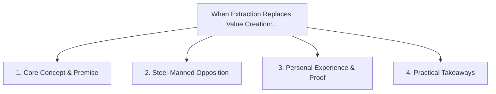

# When Extraction Replaces Value Creation: The Late-Stage Corporate Playbook

<!-- prettier-ignore-start -->
<!-- markdownlint-disable MD013 -->
**Series Context**: Part 4 of the [[topics/documents/series-the-evolution-beyond-extractive-capitalism|The Evolution Beyond Extractive Capitalism & The Myth of Self-Interest]] series.
<!-- markdownlint-restore -->
<!-- prettier-ignore-end -->

---

## 🗺️ Topic Mind Map

---

## 1. Deep-Dive Knowledge & Context

### Core Insight

When companies run out of genuine innovations, they pivot to financial engineering, subscription
lock-in, and algorithmic squeeze.

### Counter-Perspective (Steel-Manning)

Subscription models provide predictable revenue that funds continuous software updates and security
patches.

### Nuances & Blind Spots

- Practical implementation edge cases when adopting this approach in production environments.
- Distinguishing between dogmatic application and context-sensitive pragmatism.

---

## 2. Evidence, Stories & Reference Vault

### Personal Anecdotes & Field Experience

- Watching a beloved utility app switch to an exorbitant monthly subscription while crippling
  offline features.

### Metaphors & Analogies

- **Boiling a frog in water that gets 1 degree warmer every quarter.**

---

## 3. Practical Action & Takeaways

1. **First Step**: Audit existing workflows or codebases for this specific failure mode or pattern.
2. **Rule of Thumb**: Prefer explicit, decoupled, and durable implementations over transient
   convenience.
3. **Core Metric**: Reduced maintenance friction, lower cognitive load, and sustained velocity.

---

## 4. Multi-Channel Repurposing Matrix

### Medium / Substack (Focused Deep Dive)

- Narrative arc exploring the problem, field scar tissue, counter-arguments, and solution.

### BlueSky (Micro & Thread Hook)

- **Hook**: "A counter-intuitive lesson from 20+ years of engineering: When companies run out of
  genuine innovations, they pivot to financial engineering, subscription lock-in, and algorithmi...
  🧵"

### YouTube / TikTok (Short & Video Vector)

- **Hook**: 60-second walkthrough centered on the metaphor: _Boiling a frog in water that gets 1
  degree warmer every quarter._.
