# Why Don't Dev Teams Get Dev Budgets? The Hidden Cost Center Trap

## 🗺️ Topic Mind Map

```mermaid
graph TD
    BUDGET["Why Dev Teams Don't Get Dev Budgets"]

    %% Branches
    BUDGET --> COST_CENTER["1. The 'Cost Center' Perception"]
    BUDGET --> COMM_GAP["2. The Translation Failure (Dev vs Exec)"]
    BUDGET --> INVISIBLE_TAX["3. The Invisible Tax of Cheap Tooling"]
    BUDGET --> STEELMAN["4. Counter-Perspective: Executive Reality"]
    BUDGET --> REPURPOSE["5. Multi-Platform Distribution"]

    %% Cost Center
    COST_CENTER --> SALES_VS_DEV["Sales gets unlimited steak dinners; Devs fight for a $20 IDE license"]
    COST_CENTER --> REVENUE_LINE["Sales is tied directly to top-line; Engineering is booked as overhead"]

    %% Comm Gap
    COMM_GAP --> JARGON["Engineers ask for 'clean refactoring' instead of 'risk reduction'"]
    COMM_GAP --> ROI_MATH["Failure to present hard numbers on developer velocity and attrition"]

    %% Invisible Tax
    INVISIBLE_TAX --> TIME_WASTE["Saving $50/mo on CI/CD while 10 engineers waste 5 hrs/week waiting on builds"]
    INVISIBLE_TAX --> BURNOUT["Developer friction leads directly to silent disengagement and turnover"]

    %% Steelman
    STEELMAN --> SPRAWL["Unchecked SaaS sprawl and abandoned developer subscriptions"]
    STEELMAN --> SHINY_OBJECT["Engineers requesting expensive tools to play with new tech rather than solve business bottlenecks"]

    %% Repurpose
    REPURPOSE --> MED["Medium: Comprehensive Economic Breakdown"]
    REPURPOSE --> BS["BlueSky: 5-Post Viral Tech Economics Thread"]
    REPURPOSE --> YT["YouTube: Whiteboard ROI Math Breakdown"]
```

---

## 1. Core Thesis & Nuance

### The Core Premise

In almost every enterprise, sales and marketing teams enjoy generous budgets for client dinners,
conferences, and tooling, while engineering teams must fight tooth-and-nail through four layers of
procurement approval to expense a $20/month developer tool. Companies happily burn hundreds of
thousands of dollars in lost developer time due to sluggish CI/CD pipelines, obsolete hardware, and
archaic tooling—all to "save" a few thousand dollars in explicit software line items.

### The Counter-Perspective (Steel-Manning Executive Finance)

1. **SaaS Sprawl & Waste**: Left unchecked, developer teams accumulate dozens of redundant tools,
   abandoned Cloud sandboxes, and unused seat licenses that bloat overhead.
2. **The "Shiny Object" Risk**: Finance has seen engineers demand expensive licenses for the latest
   trendy framework or tool, only to abandon it 6 months later.
3. **Attribution Clarity**: Sales spend has immediate, direct attribution to closed-won revenue;
   developer tooling spend has indirect, long-term attribution to developer velocity and code
   stability.

### Blind Spots & Nuances

- Engineers often fail to write business cases: asking for a tool because "it's better" instead of
  demonstrating: _(10 engineers * 30 min saved/day * $100/hr = $130k annual savings for a $2k
  tool)_.

---

## 2. Evidence & Story Bank

### Personal Anecdotes

- Watching a company stall a
  $2,000 CI upgrade for 6 months while 20 developers sat idle
  for 45 minutes every morning waiting for slow monolithic builds to compile ($30,000+
  in wasted payroll per month).
- Successfully unlocking budgets by pitching tooling upgrades in terms of developer retention and
  reduced Mean Time to Recovery (MTTR).

### Metaphors & Analogies

- **The Dull Chainsaw**: A logger refusing to spend $15 to sharpen their chainsaw because "we don't
  have the budget for sharpening supplies," while taking 4 times longer to cut down every tree.

---

## 3. Multi-Channel Repurposing Matrix

### Medium (Anchor Essay)

- **Title**: _Why Don't Dev Teams Get Dev Budgets? The Million-Dollar Cost of Saving $50 on Tooling_
- **Sections**:
  1. The $20 IDE License vs. The $5,000 Steak Dinner.
  2. The Invisible Tax of Developer Friction.
  3. How Finance Views Engineering (And Why It’s Your Fault, Too).
  4. The 1-Page Business Case Every Senior Engineer Should Use.

### BlueSky (Thread)

- **Hook**: "Companies will spend
  $200,000/year on a senior engineer and then force them to
  waste 5 hours a week waiting on a slow CI build to save $100/month
  on cloud runners. Here is why the tech budget paradox exists: 🧵"

---

## 4. Interactive Discussion Prompt

> _"What is the most ridiculous developer expense or tool purchase your company refused to approve,
> and how much money did that refusal actually cost them in lost time?"_
