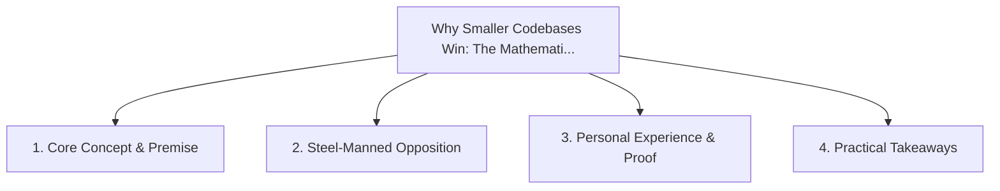

# Why Smaller Codebases Win: The Mathematical Edge of Compact Repositories

<!-- prettier-ignore-start -->
<!-- markdownlint-disable MD013 -->
**Series Context**: Part 4 of the [[topics/documents/series-the-automated-code-pruner|The Automated Code Pruner & Dead Baggage Purge]] series.
<!-- markdownlint-restore -->
<!-- prettier-ignore-end -->

---

## 🗺️ Topic Mind Map

---

## 1. Deep-Dive Knowledge & Context

### Core Insight

Compact codebases fit entirely into AI context windows, build in seconds, and have exponentially
fewer surface interactions for bugs.

### Counter-Perspective (Steel-Manning)

Monorepos with shared enterprise libraries enable broad code reuse across hundreds of engineers.

### Nuances & Blind Spots

- Practical implementation edge cases when adopting this approach in production environments.
- Distinguishing between dogmatic application and context-sensitive pragmatism.

---

## 2. Evidence, Stories & Reference Vault

### Personal Anecdotes & Field Experience

- Condensing a bloated multi-repo microservice cluster into a lean, unified 10,000-line service.

### Metaphors & Analogies

- **A nimble speedboat navigating shallow reefs where massive container ships get grounded.**

---

## 3. Practical Action & Takeaways

1. **First Step**: Audit existing workflows or codebases for this specific failure mode or pattern.
2. **Rule of Thumb**: Prefer explicit, decoupled, and durable implementations over transient
   convenience.
3. **Core Metric**: Reduced maintenance friction, lower cognitive load, and sustained velocity.

---

## 4. Multi-Channel Repurposing Matrix

### Medium / Substack (Focused Deep Dive)

- Narrative arc exploring the problem, field scar tissue, counter-arguments, and solution.

### BlueSky (Micro & Thread Hook)

- **Hook**: "A counter-intuitive lesson from 20+ years of engineering: Compact codebases fit
  entirely into AI context windows, build in seconds, and have exponentially fewer surface
  interacti... 🧵"

### YouTube / TikTok (Short & Video Vector)

- **Hook**: 60-second walkthrough centered on the metaphor: _A nimble speedboat navigating shallow
  reefs where massive container ships get grounded._.
