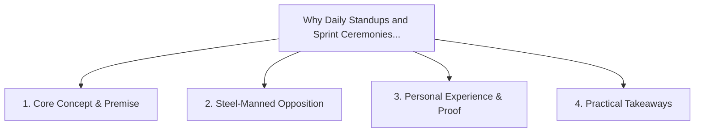

# Why Daily Standups and Sprint Ceremonies Fail Neurodivergent Engineers

<!-- prettier-ignore-start -->
<!-- markdownlint-disable MD013 -->
**Series Context**: Part 6 of the [[topics/documents/series-neurodiversity-and-systems-thinking|Neurodiversity, ADHD & Systems Thinking in Tech]] series.
<!-- markdownlint-restore -->
<!-- prettier-ignore-end -->

---

## 🗺️ Topic Mind Map

---

## 1. Deep-Dive Knowledge & Context

### Core Insight

Rigid, synchronized agile rituals shatter hyperfocus states; async communication and outcome-based
trust preserve cognitive flow.

### Counter-Perspective (Steel-Manning)

Junior engineers often rely on daily standups for unblocking and immediate mentorship.

### Nuances & Blind Spots

- Practical implementation edge cases when adopting this approach in production environments.
- Distinguishing between dogmatic application and context-sensitive pragmatism.

---

## 2. Evidence, Stories & Reference Vault

### Personal Anecdotes & Field Experience

- Having an entire afternoon of architectural focus shattered by a 15-minute 2 PM status meeting.

### Metaphors & Analogies

- **Waking a sleepwalker every 20 minutes to ask them if they are still asleep.**

---

## 3. Practical Action & Takeaways

1. **First Step**: Audit existing workflows or codebases for this specific failure mode or pattern.
2. **Rule of Thumb**: Prefer explicit, decoupled, and durable implementations over transient
   convenience.
3. **Core Metric**: Reduced maintenance friction, lower cognitive load, and sustained velocity.

---

## 4. Multi-Channel Repurposing Matrix

### Medium / Substack (Focused Deep Dive)

- Narrative arc exploring the problem, field scar tissue, counter-arguments, and solution.

### BlueSky (Micro & Thread Hook)

- **Hook**: "A counter-intuitive lesson from 20+ years of engineering: Rigid, synchronized agile
  rituals shatter hyperfocus states; async communication and outcome-based trust preserve cognit...
  🧵"

### YouTube / TikTok (Short & Video Vector)

- **Hook**: 60-second walkthrough centered on the metaphor: _Waking a sleepwalker every 20 minutes
  to ask them if they are still asleep._.
