# Why TDD Actually Matters: Hitting Bullseyes vs. Drawing Circles Around Darts

## 🗺️ Topic Mind Map

```mermaid
graph TD
    TDD["Why TDD Actually Matters"]

    %% Branches
    TDD --> ANALOGY["1. The Dartboard Analogy"]
    TDD --> DESIGN["2. TDD as Design Tool vs Testing Tool"]
    TDD --> PITFALLS["3. Why Most Developers Hate TDD"]
    TDD --> STEELMAN["4. Counter-Perspective & Nuances"]
    TDD --> REPURPOSE["5. Multi-Channel Formats"]

    %% Analogy
    ANALOGY --> HIT["Real TDD: Identifying the target, then aiming to hit it"]
    ANALOGY --> RETRO["Retrofit Testing: Throwing a dart at a blank wall, then painting a bullseye around where it landed"]

    %% Design
    DESIGN --> API["Forces you to consume your API before you implement it"]
    DESIGN --> COUPLING["Naturally prevents tight coupling & bloated classes"]

    %% Pitfalls
    PITFALLS --> MOCK_HELL["Mocking internal implementation details instead of behaviors"]
    PITFALLS --> FRAGILITY["Tests that break on every minor refactor"]

    %% Steelman
    STEELMAN --> PROTOTYPES["Spikes and exploratory prototyping where requirements are unknown"]
    STEELMAN --> TIME_PRESSURE["Initial velocity friction for teams unfamiliar with TDD"]

    %% Repurpose
    REPURPOSE --> MED["Medium: Deep Architectural Guide"]
    REPURPOSE --> BS["BlueSky: Visual Thread on Bad vs Good Unit Tests"]
    REPURPOSE --> YT["YouTube: Whiteboard Dartboard Metaphor"]
```

---

## 1. Core Thesis & Nuance

### The Core Premise
Most developers view Test-Driven Development as an annoying compliance requirement or an afterthought testing chore. Writing tests *after* code is written often amounts to throwing a dart at a blank wall and painting a bullseye around where it landed—it tests what the code *happens to do*, not what it *should do*. True TDD is fundamentally a software design tool: it forces you to experience the ergonomic pain of your interface before you write a single line of internal implementation.

### The Counter-Perspective (Steel-Manning Non-TDD)
1. **Exploratory Spiking**: When researching an unfamiliar API or prototyping a proof-of-concept, you often don't know the inputs and outputs yet; forcing TDD too early can stifle rapid discovery.
2. **The Mocking Trap**: Dogmatic TDD often leads developers to mock every collaborator, producing fragile tests that verify implementation details rather than observable business outcomes.
3. **UI / Visual Layers**: Pure visual styling and fluid UX transitions are often faster to validate visually in a browser than through rigid unit tests.

### Blind Spots & Nuances
- Distinguishing between testing *contracts/behaviors* vs. testing *implementation guts*.
- When to abandon a strict test-first approach in favor of exploratory spikes, followed by disciplined test-driven refactoring.

---

## 2. Evidence & Story Bank

### Personal Anecdotes
- Writing unit tests without `beforeEach` state bleeding and avoiding over-mocking to keep tests resilient over years of production refactors.
- Watching systems with 95% test coverage break instantly in production because the tests were simply affirming existing buggy assumptions.

### Metaphors & Analogies
- **The Dartboard**: Throwing a dart and painting the circle around it ensures 100% accuracy, but zero skill and zero predictability. Setting the board first and practicing until you hit the bullseye is engineering.

---

## 3. Multi-Channel Repurposing Matrix

### Medium (Anchor Essay)
- **Title**: *Why TDD Actually Matters: The Difference Between Aiming at a Target and Painting Circles Around Darts*
- **Sections**:
  1. The Great Test-After Illusion.
  2. The Dartboard Metaphor.
  3. TDD is a Design Ergonomics Tool, Not a QA Tool.
  4. How to Escape "Mock Hell" and Write Tests That Survive Refactoring.

### BlueSky (Thread)
- **Hook**: "Writing tests after your code is finished is like throwing a dart at a wall and painting the bullseye around where it landed. Here is why true TDD is actually about software design, not testing: 🧵"

---

## 4. Interactive Discussion Prompt
> *"Have you ever seen a codebase with near-100% test coverage that still broke constantly in production? What were those tests actually testing?"*
