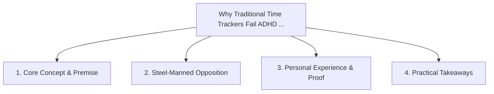

# Why Traditional Time Trackers Fail ADHD Brains: Alarm Fatigue and Nag-Blindness

<!-- prettier-ignore-start -->
<!-- markdownlint-disable MD013 -->
**Series Context**: Part 1 of the [[topics/documents/series-the-context-aware-time-tracker|The Context-Aware Time Tracker & Anti-Nag Productivity]] series.
<!-- markdownlint-restore -->
<!-- prettier-ignore-end -->

---

## 🗺️ Topic Mind Map

---

## 1. Deep-Dive Knowledge & Context

### Core Insight

When reminders pop up indiscriminately during deep focus or screen shares, the ADHD brain rapidly
develops automatic dismissal reflexes.

### Counter-Perspective (Steel-Manning)

Frequent reminders prevent time-blind individuals from missing urgent external deadlines.

### Nuances & Blind Spots

- Practical implementation edge cases when adopting this approach in production environments.
- Distinguishing between dogmatic application and context-sensitive pragmatism.

---

## 2. Evidence, Stories & Reference Vault

### Personal Anecdotes & Field Experience

- Dismissing a critical calendar reminder in 0.2 seconds while typing code without even reading the
  title.

### Metaphors & Analogies

- **Car alarms in a city: after hearing them ten times a day, nobody even looks out the window.**

---

## 3. Practical Action & Takeaways

1. **First Step**: Audit existing workflows or codebases for this specific failure mode or pattern.
2. **Rule of Thumb**: Prefer explicit, decoupled, and durable implementations over transient
   convenience.
3. **Core Metric**: Reduced maintenance friction, lower cognitive load, and sustained velocity.

---

## 4. Multi-Channel Repurposing Matrix

### Medium / Substack (Focused Deep Dive)

- Narrative arc exploring the problem, field scar tissue, counter-arguments, and solution.

### BlueSky (Micro & Thread Hook)

- **Hook**: "A counter-intuitive lesson from 20+ years of engineering: When reminders pop up
  indiscriminately during deep focus or screen shares, the ADHD brain rapidly develops automatic
  dis... 🧵"

### YouTube / TikTok (Short & Video Vector)

- **Hook**: 60-second walkthrough centered on the metaphor: _Car alarms in a city: after hearing
  them ten times a day, nobody even looks out the window._.
