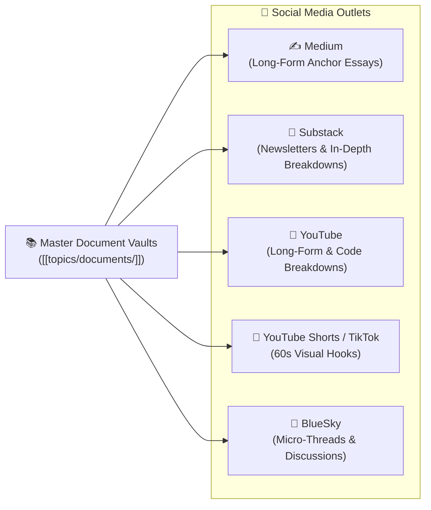

# Social Media & Multi-Platform Distribution Hub

This document tracks how deep-dive knowledge documents from `topics/documents/` are repurposed across target social media channels into tailored formats and campaigns.

---

## 🗺️ Multi-Channel Distribution Graph

---

## 📁 Channel Hubs & Repurposing Registry

### 1. Medium & Substack (Anchor Essays & Newsletters)
- **Folder**: `topics/social/medium/`, `topics/social/substack/`
- **Format**: 1,200–2,000 word comprehensive narrative essays with full context, code examples, and diagrams.
- **Pipeline**:
  - [[topics/documents/alone-but-not-lonely\|alone-but-not-lonely.md]]: Solitude vs Loneliness personal essay.
  - [[topics/documents/the-500-dollar-aspirin\|the-500-dollar-aspirin.md]]: Enterprise architecture & consulting lessons.
  - [[topics/documents/what-the-heck-is-this\|what-the-heck-is-this.md]]: Visual deep dive into JS execution context.
  - [[topics/documents/the-fast-food-fallacy\|the-fast-food-fallacy.md]]: Technical debt and engineering quality breakdown.

### 2. YouTube (Long-Form & Deep-Dives)
- **Folder**: `topics/social/youtube/`
- **Format**: 8–15 minute structured video breakdowns, slide/diagram walkthroughs, and code architectural reviews.
- **Pipeline**:
  - [[topics/documents/what-the-heck-is-this\|what-the-heck-is-this.md]]: Interactive visual slides explaining call sites.
  - [[topics/documents/why-tdd-matters\|why-tdd-matters.md]]: Live refactoring demo proving test pressure on design.
  - [[topics/documents/the-charisma-trap\|the-charisma-trap.md]]: Talking head essay on leadership and tech talent.

### 3. YouTube Shorts & TikTok (Short-Form Micro Videos)
- **Folder**: `topics/social/tiktok/`, `topics/social/youtube/`
- **Format**: 45–60 second vertical videos featuring 1 hook, 1 relatable metaphor, and 1 actionable conclusion.
- **Pipeline**:
  - [[topics/documents/the-loyalty-trap\|the-loyalty-trap.md]]: Tenure vs. Impact in 60 seconds.
  - [[topics/documents/the-500-dollar-aspirin\|the-500-dollar-aspirin.md]]: "Why enterprise software is like a hospital bill".
  - [[topics/documents/humility-is-not-low-self-esteem\|humility-is-not-low-self-esteem.md]]: "The difference between confidence and arrogance".

### 4. BlueSky (Micro-Posts & Discussion Threads)
- **Folder**: `topics/social/bluesky/`
- **Format**: 5–7 post threads summarizing counter-intuitive points and ending with an open question.
- **Pipeline**:
  - All documents have active BlueSky thread outlines.
