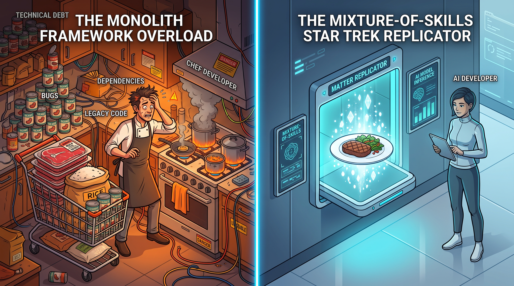
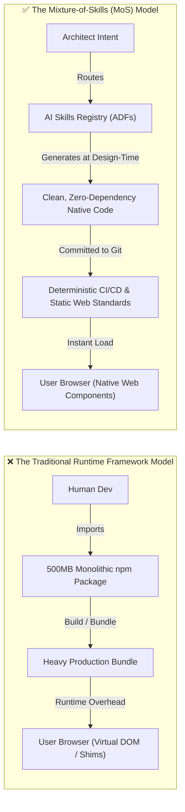

# The Mixture-of-Skills Architecture: Why AI Makes Monolithic Frameworks Obsolete



In my many years of experience building web applications—going all the way back to the early days
before jQuery, npm, or modern build pipelines existed—I've watched our industry swing through
several major pendulum shifts.

Every single shift was driven by the exact same constraint: our typing speed and cognitive
bandwidth were the main bottlenecks.

When you had to write every DOM manipulation by hand, work around quirky browser rendering engines,
and manually manage state in vanilla JavaScript, building software felt like carving wheels out of
stone. Frameworks stepped in to draw a clear line in the sand. They gave us shared structures,
enforced conventions across growing teams, and packaged up massive ecosystems so we didn't have to
reinvent the wheel on every single sprint.

Frameworks solved a real human coordination problem.

That being said, we accepted an enormous hidden tax along the way. Now that AI coding agents can
inspect, generate, lint, and refactor code directly in our repositories, the economic calculus that
made monolithic frameworks necessary has changed.

---

## The Pre-Packaged Grocery Cart Tax

Think about how we build software today.

Suppose you want to cook a simple dinner: a steak, a side of rice, and a few vegetables. In the
traditional software ecosystem, you can't just buy the ingredients you need. You're forced to buy
a pre-packaged bulk grocery cart: a 3-pound family pack of steaks, a 20-pound sack of rice, and
crates of canned beans stacked to the ceiling.

To cook that meal, your kitchen has to keep five burners roaring on the stove just to maintain the
pans you aren't even using. You pay for the bulk packaging up front, you clutter your pantry with
excess inventory, and six months later you're still auditing the expired cans in the back of the
cabinet to make sure they aren't leaking.

That is your `node_modules` folder.

```text
┌─────────────────────────────────────────────────────────────┐
│                    THE FRAMEWORK TAX                        │
├───────────────────────────────┬─────────────────────────────┤
│ 🛒 Bulk Packaging             │ 500MB+ node_modules for     │
│                               │ a 5KB feature               │
├───────────────────────────────┼─────────────────────────────┤
│ 📦 Upstream Lock-In           │ Major version migration     │
│                               │ nightmares (React/Angular)  │
├───────────────────────────────┼─────────────────────────────┤
│ 🚨 Phantom Security Alerts    │ Hundreds of CVEs in dead,   │
│                               │ uncalled transitive code    │
├───────────────────────────────┼─────────────────────────────┤
│ ⏳ Runtime Hydration Penalties │ Sluggish Time-to-Interactive│
│                               │ on mobile devices           │
└───────────────────────────────┴─────────────────────────────┘
```

When you import a monolithic framework or a massive UI library, you aren't just importing the 5% of
the feature set you actually use. You are importing thousands of transitive dependencies, complex
virtual DOM diffing engines, synthetic event systems, and opinionated lifecycle abstractions that
all run in your user's browser.

We took on that baggage because writing the boilerplate ourselves would take weeks of developer
time.

---

## The Inversion: Design-Time vs. Build-Time

Here is how the mental model shifts: AI moves framework complexity upstream.

Historically, frameworks had to exist at build time and runtime because human teams couldn't
maintain thousands of bespoke lines of code without a shared runtime shim.

In an AI-orchestrated workflow, that intelligence moves to design time.



Instead of pulling in a 200KB third-party state library or an entire UI suite, an AI agent consults
a specialized **AI Development Framework (ADF)**—a markdown skill defining patterns, security
rules, and accessibility constraints—and synthesizes the exact 50 lines of native TypeScript or
Web Components required for that specific feature.

It works like a Star Trek replicator. You provide the blueprint, and it synthesizes the exact meal
on demand. No bulk carts, no leftover cans, and zero runtime baggage.

---

## Why Higher Abstractions Always Win: The Assembly Precedent

Whenever I talk with engineering leaders about moving away from heavy runtime frameworks, the
immediate pushback is usually:

> *"If we don't use React or Angular, aren't we just writing brittle vanilla code that nobody can
> maintain?"*

I understand that concern, but it overlooks how software abstractions have always evolved.

In the 1960s, systems programmers made the exact same argument against compiled languages like C
and FORTRAN. They insisted that hand-tuned assembly was more efficient and that compilers would
generate bloated machine code that nobody could debug.

For a brief period, hand-tuned assembly was faster. But as compilers matured, they quickly
outperformed human assembly programmers, freeing engineers to focus on business logic and systems
architecture instead of raw memory registers.

```text
┌─────────────────────────────────────────────────────────────┐
│              THE EVOLUTION OF ABSTRACTION                   │
├─────────────────────────────────────────────────────────────┤
│ 1960s: Assembly Hand-Coding ──► C / FORTRAN Compilers       │
│        (Human wrote registers; compiler automated machine)  │
├─────────────────────────────────────────────────────────────┤
│ 2010s: Vanilla DOM Wrangling ──► Monolithic Frameworks      │
│        (Human wrote boilerplate; framework abstracted DOM)  │
├─────────────────────────────────────────────────────────────┤
│ 2026+: Runtime Frameworks ──► Mixture-of-Skills (MoS)       │
│        (AI writes standard code; skills govern architecture)│
└─────────────────────────────────────────────────────────────┘
```

The Mixture-of-Skills architecture is the next step in that progression. The AI agent acts as our
optimizing compiler. The skills supply the architectural rules and linting constraints. And the
output is clean, standard, zero-dependency code that runs natively in modern web browsers.

---

## The 3-Tier AI Development Framework (ADF)

To make this work reliably across an engineering organization, you can't have AI generating
unstructured code. You need a structured hierarchy:

```text
┌─────────────────────────────────────────────────────────────┐
│                 THE 3-TIER ADF HIERARCHY                    │
├─────────────────────────────────────────────────────────────┤
│ 🌐 Tier 1: Canonical ADFs (Public Open Standards)           │
│    • Universal Web Standards, A11y, OWASP Security          │
├─────────────────────────────────────────────────────────────┤
│ 🏢 Tier 2: Org Methodologies (Enterprise Governance)        │
│    • Design Tokens, Auth Pipelines, Compliance Rules        │
├─────────────────────────────────────────────────────────────┤
│ 🎯 Tier 3: Application Blueprints (Domain Logic)            │
│    • Specific feature schemas, local data models            │
└─────────────────────────────────────────────────────────────┘
```

1. **Tier 1: Canonical ADFs (Public Standards)**: Open-source, shared skill definitions governing
   baseline best practices—W3C accessibility guidelines, semantic HTML5 rules, OWASP Top 10
   security defenses, and modern CSS layout standards.
2. **Tier 2: Org Methodologies (Enterprise Governance)**: The company's architectural playbook,
   defining design system tokens, internal API conventions, logging patterns, and CI/CD policies.
3. **Tier 3: Application Blueprints (Local Implementation)**: The specific context and domain models
   for the micro-service or application you're building.

When an AI agent writes code, it routes across these active skills. It follows deterministic rules
defined in your repository and verified by strict local linters.

---

## Decoupling Skill Upgrades from Production Code

One of the most frustrating parts of modern web development is the framework upgrade treadmill.

Most developers have spent months migrating a production codebase from one major framework version
to another—rewriting class components to hooks, fixing broken build configurations, or adjusting to
routing overhauls—without delivering any new value to users.

In the Mixture-of-Skills model, upgrades happen to the skills rather than the running code.

When the W3C introduces a native API like the Popover API or CSS Subgrid, you update the skill
definition in your ADF registry. The existing native code keeps running in production without
issues. When you next touch that feature, the AI agent uses the updated skill to refactor the
component cleanly.

That decouples your team from the upgrade cycle.

---

## The Monday Morning Experiment

You don't need to rewrite your entire production stack to try this. Start with an isolated trial:

1. **Pick an Isolated Utility**: Choose one self-contained component in your backlog that
   traditionally pulls in an npm package—such as a date-picker, a modal dialog, a debounced search
   input, or a CSV export utility.
2. **Define the Skill Rules**: Write a lightweight markdown rule file outlining your standards
   (zero runtime dependencies, W3C Web Component or native TypeScript, WCAG AA accessibility, and
   CSS custom properties for theming).
3. **Generate with MoS**: Have your AI agent generate the solution using native platform APIs and
   validate it against your test suite.
4. **Compare the Diff**: Measure the bundle size difference, run your benchmarks, and see whether
   your team finds the resulting native code clearer and easier to maintain.

---

## Moving Beyond the Framework Crutch

Frameworks served an important purpose when typing speed and cognitive overload were our main
limitations.

```text
┌─────────────────────────────────────────────────────────────┐
│                    SUMMARY TAKEAWAYS                        │
├───────────────────────────────┬─────────────────────────────┤
│ 💡 Human Bottlenecks          │ Frameworks solved human     │
│                               │ typing limitations          │
├───────────────────────────────┼─────────────────────────────┤
│ 🧠 Design-Time Shift          │ AI moves architectural      │
│                               │ intelligence upstream       │
├───────────────────────────────┼─────────────────────────────┤
│ 🚀 Zero-Dependency Native Code │ Mixture-of-Skills replaces  │
│                               │ runtime bloat               │
├───────────────────────────────┼─────────────────────────────┤
│ 🏛️ Long-Term Durability       │ Web standards live forever; │
│                               │ framework trends fade       │
└───────────────────────────────┴─────────────────────────────┘
```

Software architecture isn't about picking between React, Vue, or Angular anymore. It's about
building skill registries that let AI agents generate lean, accessible, zero-dependency software
directly on open web standards.

We can put down the bulk grocery cart and start building with the replicator.
