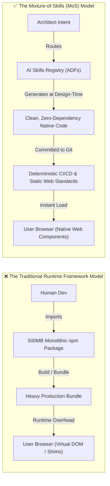

# The Mixture-of-Skills Architecture: Why AI Makes Monolithic Frameworks Obsolete


In my many years of experience building web applications—going all the way back to the wild west
days before jQuery, npm, or modern build pipelines existed—I've watched the industry swing through
several massive pendulum shifts.

Every single shift was driven by the exact same fundamental constraint: **human typing and human
cognitive bandwidth were our primary bottlenecks.**

When you had to write every DOM manipulation by hand, ensure cross-browser compatibility across
quirky rendering engines, and manually manage state in vanilla JavaScript, software development
felt like carving wheels out of stone. Frameworks stepped in to draw a line in the sand. They gave
us opinionated structures, enforced conventions across chaotic teams, and packaged up massive
tooling ecosystems so we didn't have to re-invent the wheel on every single sprint.

Frameworks solved a genuine human coordination problem.

But in doing so, we accepted an enormous hidden tax—one that has grown heavier with every passing
year. And now that autonomous AI coding agents can generate, inspect, lint, and refactor code
instantaneously, the economic calculus that made monolithic frameworks necessary has completely
evaporated.

---

## The Pre-Packaged Grocery Cart Tax

Think about how you build software today.

Suppose you want to cook a simple dinner—say, a steak, a side of rice, and a few vegetables. In the
traditional software ecosystem, you don't just buy the ingredients you need. You're forced to buy
a pre-packaged bulk grocery cart: a 3-pound family pack of steaks, a 20-pound sack of rice, and
crates of canned beans stacked precariously to the ceiling.

To cook that meal, your kitchen has to keep five burners roaring simultaneously just to maintain the
pans you aren't even using. You pay for the bulk packaging up front, you clutter your pantry with
excess inventory, and six months later you're still auditing the expired cans in the back of the
cabinet to make sure they aren't leaking.

That is your `node_modules` folder.

```text
┌─────────────────────────────────────────────────────────────┐
│                    THE FRAMEWORK TAX                        │
├───────────────────────────────┬─────────────────────────────┤
│ 🛒 Bulk Packaging             │ 500MB+ node_modules for     │
│                               │ a 5KB feature               │
├───────────────────────────────┼─────────────────────────────┤
│ 📦 Upstream Lock-In           │ Major version migration     │
│                               │ nightmares (React/Angular)  │
├───────────────────────────────┼─────────────────────────────┤
│ 🚨 Phantom Security Alerts    │ Hundreds of CVEs in dead,   │
│                               │ uncalled transitive code    │
├───────────────────────────────┼─────────────────────────────┤
│ ⏳ Runtime Hydration Penalties │ Sluggish Time-to-Interactive│
│                               │ on mobile devices           │
└───────────────────────────────┴─────────────────────────────┘
```

When you import a monolithic framework or a massive UI library, you aren't just importing the 5% of
the feature set you actually use. You are importing thousands of transitive dependencies, complex
virtual DOM diffing engines, synthetic event systems, and opinionated lifecycle abstractions that
must execute in your user's browser.

You accept this baggage because writing the boilerplate yourself would take weeks of senior
developer time.

---

## The Inversion: Design-Time vs. Build-Time

Here is the mental model shift: **AI inverts where framework complexity belongs.**

Historically, frameworks had to exist at **build time and runtime**. Because human engineers
couldn't maintain millions of bespoke lines of code, the framework acted as a runtime shim.

In an AI-orchestrated workflow, the intelligence moves upstream to **design time**.



Instead of pulling in a 200KB third-party state library or an entire UI component suite, an AI
agent consults a specialized **AI Development Framework (ADF)**—a markdown-based skill package
defining exact patterns, security constraints, and accessibility rules—and synthesizes the exact,
lean 50 lines of native TypeScript or Web Components required for that specific feature.

It is the software equivalent of a **Star Trek replicator**. You provide the blueprint, and it
synthesizes the exact meal on demand. No bulk carts, no leftover cans, and zero runtime baggage.

---

## Why Higher Abstractions Always Win: The Assembly Precedent

Whenever I talk to engineering leaders about moving away from heavy runtime frameworks, the
immediate pushback is predictable:

> *"If you don't use React or Angular, aren't you just reinventing the wheel and writing brittle,
> unmaintainable vanilla code?"*

This objection misses the entire history of software abstraction.

In the 1960s, senior systems programmers argued vehemently against third-generation compiled
languages like C and FORTRAN. Their argument sounded identical: *"Hand-tuned assembly is far more
efficient. A compiler will produce bloated, unreadable machine code that nobody can debug."*

For a few years, hand-tuned assembly *was* faster. But as compiler optimization matured, the
compiler consistently beat 99% of human assembly programmers. More importantly, it freed engineers
to reason at the level of algorithms and business logic rather than memory registers.

```text
┌─────────────────────────────────────────────────────────────┐
│              THE EVOLUTION OF ABSTRACTION                   │
├─────────────────────────────────────────────────────────────┤
│ 1960s: Assembly Hand-Coding ──► C / FORTRAN Compilers       │
│        (Human wrote registers; compiler automated machine)  │
├─────────────────────────────────────────────────────────────┤
│ 2010s: Vanilla DOM Wrangling ──► Monolithic Frameworks      │
│        (Human wrote boilerplate; framework abstracted DOM)  │
├─────────────────────────────────────────────────────────────┤
│ 2026+: Runtime Frameworks ──► Mixture-of-Skills (MoS)       │
│        (AI writes standard code; skills govern architecture)│
└─────────────────────────────────────────────────────────────┘
```

The Mixture-of-Skills architecture is simply the next step in this evolution. The AI agent is our
optimizing compiler. The **skills** are the architectural rules, linting constraints, and design
systems. And the output is clean, standard, zero-dependency code that runs natively in modern web
engines without needing runtime crutches.

---

## The 3-Tier AI Development Framework (ADF)

So how does this actually work in practice across an engineering organization?

You don't let AI agents generate unstructured spaghetti code. Instead, you establish a clear,
hierarchical governance model:

```text
┌─────────────────────────────────────────────────────────────┐
│                 THE 3-TIER ADF HIERARCHY                    │
├─────────────────────────────────────────────────────────────┤
│ 🌐 Tier 1: Canonical ADFs (Public Open Standards)           │
│    • Universal Web Standards, A11y, OWASP Security          │
├─────────────────────────────────────────────────────────────┤
│ 🏢 Tier 2: Org Methodologies (Enterprise Governance)        │
│    • Design Tokens, Auth Pipelines, Compliance Rules        │
├─────────────────────────────────────────────────────────────┤
│ 🎯 Tier 3: Application Blueprints (Domain Logic)            │
│    • Specific feature schemas, local data models            │
└─────────────────────────────────────────────────────────────┘
```

1. **Tier 1: Canonical ADFs (Public Standards)**: Open-source, universally shared skill definitions
   governing baseline best practices—W3C accessibility guidelines, semantic HTML5 rules, OWASP Top
   10 security defenses, and modern CSS layout standards.
2. **Tier 2: Org Methodologies (Enterprise Governance)**: The company's architectural playbook.
   This defines your design system tokens, internal API conventions, logging standards, and CI/CD
   policies.
3. **Tier 3: Application Blueprints (Local Implementation)**: The specific context and domain models
   for the micro-service or application at hand.

When an AI agent writes code, it dynamically routes across these active skills. It doesn't rely on
probabilistic guesswork; it is bound by the deterministic rules of your repository's skills and
enforced by strict local linters.

---

## Decoupling Skill Upgrades from Production Code

One of the most insidious problems in modern software engineering is the **framework upgrade
treadmill**.

How many times in your career have you spent three to six months migrating a production codebase
from one major framework version to another—rewriting class components to hooks, refactoring routing
APIs, or patching broken build configs—all while shipping exactly zero new features to your users?

In the Mixture-of-Skills model, **upgrades happen to the skills, not to the running code.**

If the W3C introduces a superior native API (like the Popover API or CSS Subgrid), you update the
skill definition in your ADF registry. The existing, deployed native code continues running in
production without breaking. When you next touch that feature, the AI agent uses the updated skill to
refactor the component cleanly.

You completely eliminate the upgrade treadmill.

---

## The Monday Morning Experiment

You don't have to rewrite your entire production application over a weekend to see this in action.
Start with what I call the **Monday Morning Experiment**:

1. **Pick an Isolated Utility**: Find one small, self-contained component in your backlog that
   traditionally pulls in a heavy npm package—like a date-picker, a modal dialog, a debounced
   search input, or a CSV export utility.
2. **Define the Skill Rules**: Write a lightweight markdown rule file defining your strict
   standards (e.g., zero runtime dependencies, W3C Web Component or pure native TypeScript, WCAG
   AA accessibility, CSS custom properties for theming).
3. **Generate with MoS**: Have your AI agent generate the solution using only native platform APIs
   and validate it against your test suite.
4. **Compare the Diff**: Measure the bundle size difference, run your performance benchmarks, and
   ask your team whether the resulting native code is easier or harder to review than a complex
   3rd-party library wrapper.

---

## Moving Beyond the Framework Crutch

Frameworks were an indispensable chapter in the history of software engineering. They brought
order to chaos when human typing and cognitive overload were our primary limitations.

```text
┌─────────────────────────────────────────────────────────────┐
│                    SUMMARY TAKEAWAYS                        │
├───────────────────────────────┬─────────────────────────────┤
│ 💡 Human Bottlenecks          │ Frameworks solved human     │
│                               │ typing limitations          │
├───────────────────────────────┼─────────────────────────────┤
│ 🧠 Design-Time Shift          │ AI moves architectural      │
│                               │ intelligence upstream       │
├───────────────────────────────┼─────────────────────────────┤
│ 🚀 Zero-Dependency Native Code │ Mixture-of-Skills replaces  │
│                               │ runtime bloat               │
├───────────────────────────────┼─────────────────────────────┤
│ 🏛️ Long-Term Durability       │ Web standards live forever; │
│                               │ framework trends fade       │
└───────────────────────────────┴─────────────────────────────┘
```

The future of software architecture isn't about choosing between React, Vue, or Angular. The future
is about building high-leverage skill registries that empower AI agents to generate lean, fast,
accessible, and zero-dependency software directly on top of open web standards.

It's time to put down the bulk grocery cart and build with the replicator.
