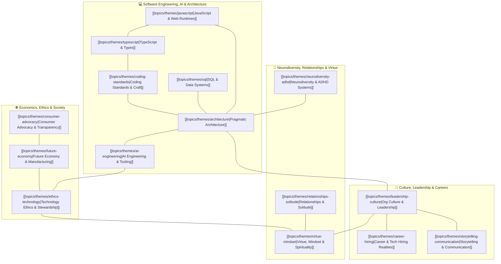

# Master Theme Mind Map & Topic Graph

This document serves as the high-level semantic knowledge graph connecting every overarching
**Theme** to its underlying deep-dive **Document Vaults** and **Multi-Part Series**.

---

## 🗺️ Master Theme Graph

---

## 📚 Master Themes Directory

| Theme                                                                          | Category                 | Focus Area                                                                                |
| :----------------------------------------------------------------------------- | :----------------------- | :---------------------------------------------------------------------------------------- |
| **[[topics/themes/architecture\|Pragmatic Architecture]]**                     | Architecture & Design    | Anti-complexity, right-sizing, durable abstractions, zero-dependency engineering          |
| **[[topics/themes/ai-engineering\|AI Engineering & Tooling]]**                 | AI & Systems             | AI skills package management, bug telemetry, guardrail benchmarking, prompt orchestration |
| **[[topics/themes/javascript\|JavaScript & Web Runtimes]]**                    | Languages & Runtimes     | Web Standards, Web Components, CSS Grid, runtime mechanics, framework fatigue             |
| **[[topics/themes/typescript\|TypeScript & Type Systems]]**                    | Languages & Verification | Static verification, test-driven architecture, avoiding type gymnastics                   |
| **[[topics/themes/sql\|SQL & Data Systems]]**                                  | Data & State             | Relational integrity, data modeling, query optimization, local SQLite caching             |
| **[[topics/themes/coding-standards\|Coding Standards & Craft]]**               | Engineering Craft        | Clean code pragmatism, testing discipline, dead code pruning, automated feature sunsets   |
| **[[topics/themes/leadership-culture\|Org Culture & Leadership]]**             | Culture & Leadership     | Consultation vs debate, servant leadership, psychological safety, blameless reviews       |
| **[[topics/themes/career-hiring\|Career & Tech Hiring Realities]]**            | Career Navigation        | 2026 job market, ghost jobs, AI resume arms race, proof-of-work, fractional roles         |
| **[[topics/themes/storytelling-communication\|Storytelling & Communication]]** | Communication & Craft    | Non-captive audiences, curse of knowledge, tactile metaphors, non-clickbait hooks         |
| **[[topics/themes/neurodiversity-adhd\|Neurodiversity & ADHD Systems]]**       | Mindset & Systems        | Hyperfocus, working memory scaffolding, anti-nag time tracking, Obsidian second brains    |
| **[[topics/themes/consumer-advocacy\|Consumer Advocacy & Transparency]]**      | Consumer Advocacy        | Anti-surveillance dynamic pricing, crowdsourced telemetry, coordinated consumer action    |
| **[[topics/themes/future-economy\|Future Economy & Manufacturing]]**           | Future Economy           | Sunset of mass production, micro-scale precision, 3D printing, post-labor economics       |
| **[[topics/themes/ethics-technology\|Technology Ethics & Stewardship]]**       | Ethics & Society         | Evolution beyond extractive capitalism, executive tenure traps, Bahá'í stewardship        |
| **[[topics/themes/relationships-solitude\|Relationships & Solitude]]**         | Personal Growth          | Peaceful solitude vs isolation, preventive therapy, two-selves remote boundaries          |
| **[[topics/themes/virtue-mindset\|Virtue, Mindset & Spirituality]]**           | Philosophy & Virtue      | True humility, self-forgetfulness, covenantal love, ego-checking, purpose                 |
