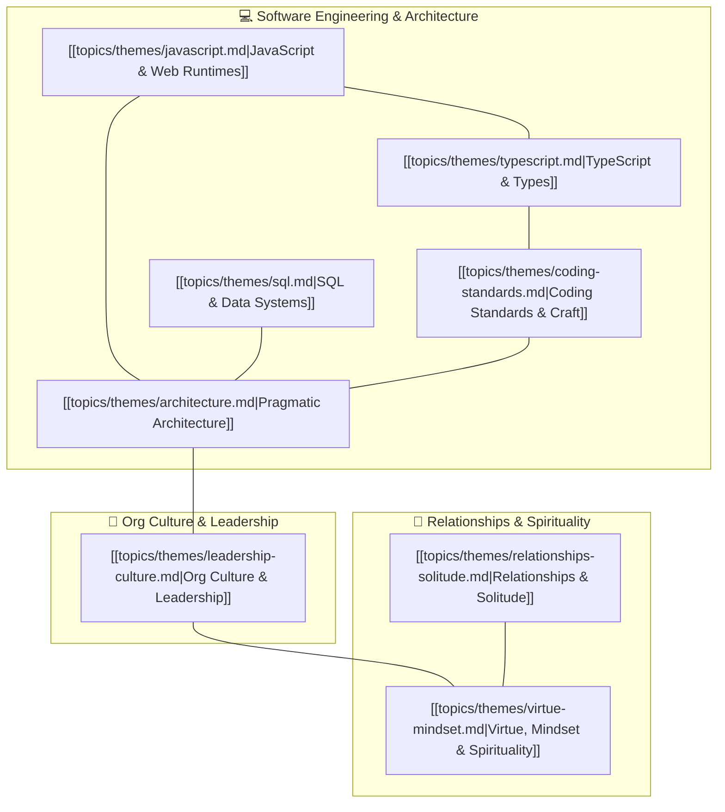

# Master Theme Mind Map & Topic Graph

This document serves as the high-level semantic knowledge graph connecting every overarching **Theme** to its underlying deep-dive **Document Vaults**.

---

## 🗺️ Master Theme Graph

---

## 📚 Themes Directory & Document Allocations

| Theme | Key Concepts Covered | Primary Document Vaults |
| :--- | :--- | :--- |
| **[JavaScript & Web Runtimes](topics/themes/javascript.md)** | Execution context, `this` binding, Web APIs, ecosystem fatigue | [what-the-heck-is-this.md](topics/documents/what-the-heck-is-this.md), [cure-for-framework-fatigue.md](topics/documents/cure-for-framework-fatigue.md), [stop-blindly-following-patterns.md](topics/documents/stop-blindly-following-patterns.md), [the-myth-of-specialization.md](topics/documents/the-myth-of-specialization.md) |
| **[TypeScript & Type Systems](topics/themes/typescript.md)** | Static verification, test-driven architecture, avoiding type gymnastics | [why-tdd-matters.md](topics/documents/why-tdd-matters.md), [stop-blindly-following-patterns.md](topics/documents/stop-blindly-following-patterns.md), [cure-for-framework-fatigue.md](topics/documents/cure-for-framework-fatigue.md) |
| **[SQL & Data Systems](topics/themes/sql.md)** | Relational integrity, data modeling, query optimization, full-stack reality | [the-myth-of-specialization.md](topics/documents/the-myth-of-specialization.md), [stop-blindly-following-patterns.md](topics/documents/stop-blindly-following-patterns.md), [the-500-dollar-aspirin.md](topics/documents/the-500-dollar-aspirin.md) |
| **[Coding Standards & Craft](topics/themes/coding-standards.md)** | Clean code pragmatism, testing discipline, tech debt reality | [stop-blindly-following-patterns.md](topics/documents/stop-blindly-following-patterns.md), [the-500-dollar-aspirin.md](topics/documents/the-500-dollar-aspirin.md), [why-tdd-matters.md](topics/documents/why-tdd-matters.md), [the-fast-food-fallacy.md](topics/documents/the-fast-food-fallacy.md), [why-devs-dont-get-budgets.md](topics/documents/why-devs-dont-get-budgets.md) |
| **[Pragmatic Architecture](topics/themes/architecture.md)** | Anti-complexity, right-sizing solutions, durable abstractions | [the-500-dollar-aspirin.md](topics/documents/the-500-dollar-aspirin.md), [cure-for-framework-fatigue.md](topics/documents/cure-for-framework-fatigue.md), [stop-blindly-following-patterns.md](topics/documents/stop-blindly-following-patterns.md), [the-myth-of-specialization.md](topics/documents/the-myth-of-specialization.md), [why-tdd-matters.md](topics/documents/why-tdd-matters.md) |
| **[Org Culture & Leadership](topics/themes/leadership-culture.md)** | Tech debt ROI, charisma vs competence, tenure traps, fast delivery myths | [why-devs-dont-get-budgets.md](topics/documents/why-devs-dont-get-budgets.md), [the-500-dollar-aspirin.md](topics/documents/the-500-dollar-aspirin.md), [the-charisma-trap.md](topics/documents/the-charisma-trap.md), [the-loyalty-trap.md](topics/documents/the-loyalty-trap.md), [the-fast-food-fallacy.md](topics/documents/the-fast-food-fallacy.md) |
| **[Relationships & Solitude](topics/themes/relationships-solitude.md)** | Introversion, peaceful solitude vs isolation, proactive therapy | [alone-but-not-lonely.md](topics/documents/alone-but-not-lonely.md), [therapy-preventive-maintenance.md](topics/documents/therapy-preventive-maintenance.md), [understanding-vs-feeling-love.md](topics/documents/understanding-vs-feeling-love.md) |
| **[Virtue, Mindset & Spirituality](topics/themes/virtue-mindset.md)** | True humility, self-forgetfulness, covenantal love, ego-checking | [humility-is-not-low-self-esteem.md](topics/documents/humility-is-not-low-self-esteem.md), [understanding-vs-feeling-love.md](topics/documents/understanding-vs-feeling-love.md), [the-charisma-trap.md](topics/documents/the-charisma-trap.md) |
