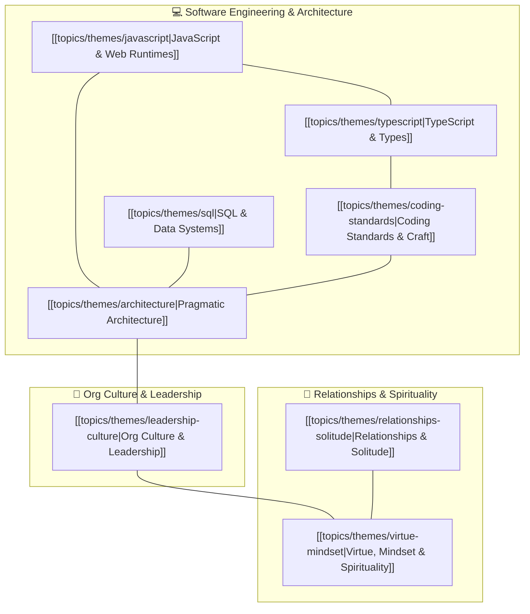

# Master Theme Mind Map & Topic Graph

This document serves as the high-level semantic knowledge graph connecting every overarching
**Theme** to its underlying deep-dive **Document Vaults**.

---

## 🗺️ Master Theme Graph

---

## 📚 Themes Directory & Document Allocations

| Theme                                                                  | Key Concepts Covered                                                        | Primary Document Vaults                                                                                                                                                                                                                                                                                                                                                                    |
| :--------------------------------------------------------------------- | :-------------------------------------------------------------------------- | :----------------------------------------------------------------------------------------------------------------------------------------------------------------------------------------------------------------------------------------------------------------------------------------------------------------------------------------------------------------------------------------- |
| **[[topics/themes/javascript\|JavaScript & Web Runtimes]]**            | Execution context, `this` binding, Web APIs, ecosystem fatigue              | [[topics/documents/what-the-heck-is-this\|what-the-heck-is-this.md]], [[topics/documents/cure-for-framework-fatigue\|cure-for-framework-fatigue.md]], [[topics/documents/stop-blindly-following-patterns\|stop-blindly-following-patterns.md]], [[topics/documents/the-myth-of-specialization\|the-myth-of-specialization.md]]                                                             |
| **[[topics/themes/typescript\|TypeScript & Type Systems]]**            | Static verification, test-driven architecture, avoiding type gymnastics     | [[topics/documents/why-tdd-matters\|why-tdd-matters.md]], [[topics/documents/stop-blindly-following-patterns\|stop-blindly-following-patterns.md]], [[topics/documents/cure-for-framework-fatigue\|cure-for-framework-fatigue.md]]                                                                                                                                                         |
| **[[topics/themes/sql\|SQL & Data Systems]]**                          | Relational integrity, data modeling, query optimization, full-stack reality | [[topics/documents/the-myth-of-specialization\|the-myth-of-specialization.md]], [[topics/documents/stop-blindly-following-patterns\|stop-blindly-following-patterns.md]], [[topics/documents/the-500-dollar-aspirin\|the-500-dollar-aspirin.md]]                                                                                                                                           |
| **[[topics/themes/coding-standards\|Coding Standards & Craft]]**       | Clean code pragmatism, testing discipline, tech debt reality                | [[topics/documents/stop-blindly-following-patterns\|stop-blindly-following-patterns.md]], [[topics/documents/the-500-dollar-aspirin\|the-500-dollar-aspirin.md]], [[topics/documents/why-tdd-matters\|why-tdd-matters.md]], [[topics/documents/the-fast-food-fallacy\|the-fast-food-fallacy.md]], [[topics/documents/why-devs-dont-get-budgets\|why-devs-dont-get-budgets.md]]             |
| **[[topics/themes/architecture\|Pragmatic Architecture]]**             | Anti-complexity, right-sizing solutions, durable abstractions               | [[topics/documents/the-500-dollar-aspirin\|the-500-dollar-aspirin.md]], [[topics/documents/cure-for-framework-fatigue\|cure-for-framework-fatigue.md]], [[topics/documents/stop-blindly-following-patterns\|stop-blindly-following-patterns.md]], [[topics/documents/the-myth-of-specialization\|the-myth-of-specialization.md]], [[topics/documents/why-tdd-matters\|why-tdd-matters.md]] |
| **[[topics/themes/leadership-culture\|Org Culture & Leadership]]**     | Tech debt ROI, charisma vs competence, tenure traps, fast delivery myths    | [[topics/documents/why-devs-dont-get-budgets\|why-devs-dont-get-budgets.md]], [[topics/documents/the-500-dollar-aspirin\|the-500-dollar-aspirin.md]], [[topics/documents/the-charisma-trap\|the-charisma-trap.md]], [[topics/documents/the-loyalty-trap\|the-loyalty-trap.md]], [[topics/documents/the-fast-food-fallacy\|the-fast-food-fallacy.md]]                                       |
| **[[topics/themes/relationships-solitude\|Relationships & Solitude]]** | Introversion, peaceful solitude vs isolation, proactive therapy             | [[topics/documents/alone-but-not-lonely\|alone-but-not-lonely.md]], [[topics/documents/therapy-preventive-maintenance\|therapy-preventive-maintenance.md]], [[topics/documents/understanding-vs-feeling-love\|understanding-vs-feeling-love.md]]                                                                                                                                           |
| **[[topics/themes/virtue-mindset\|Virtue, Mindset & Spirituality]]**   | True humility, self-forgetfulness, covenantal love, ego-checking            | [[topics/documents/humility-is-not-low-self-esteem\|humility-is-not-low-self-esteem.md]], [[topics/documents/understanding-vs-feeling-love\|understanding-vs-feeling-love.md]], [[topics/documents/the-charisma-trap\|the-charisma-trap.md]]                                                                                                                                               |
