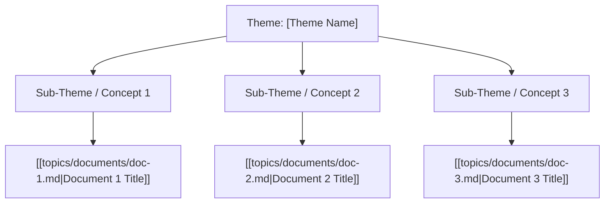

# Theme Template

## Metadata
- **Theme Name**: [Theme Name]
- **Category**: [Software Engineering | Architecture | Career & Culture | Relationships & Personal Growth | Spirituality]
- **Related Themes**: [[topics/themes/other-theme.md|Other Theme]]

---

## 🗺️ Theme Mind Map

---

## 📚 Related Document Vaults

| Document Title | ID | Pillar | Status | Core Angle / Contribution to Theme |
| :--- | :--- | :--- | :--- | :--- |
| [Doc Title](topics/documents/doc-1.md) | `DOC-001` | Pillar Name | Outlined | Summary of how this document relates to the theme |

---

## 💡 Key Theme Principles & Notes
- Key takeaway or philosophical anchor for this theme.
- Core debates, common fallacies, or recurring questions.
