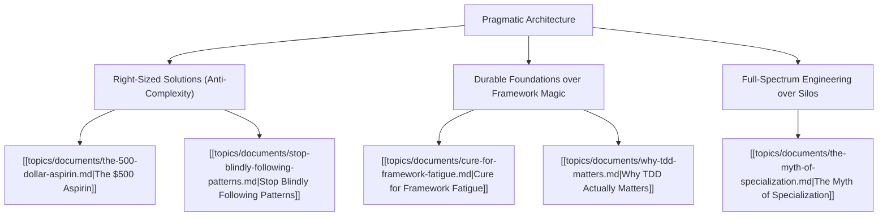

# Theme: Pragmatic Architecture & Systems Thinking

## Metadata
- **Theme Name**: Pragmatic Architecture & Systems Thinking
- **Category**: Architecture & Engineering Design
- **Related Themes**: [[topics/themes/coding-standards.md|Coding Standards]], [[topics/themes/javascript.md|JavaScript]], [[topics/themes/leadership-culture.md|Org Culture & Leadership]]

---

## 🗺️ Theme Mind Map

---

## 📚 Related Document Vaults

| Document Title | ID | Pillar | Status | Core Angle / Contribution to Theme |
| :--- | :--- | :--- | :--- | :--- |
| [The $500 Aspirin](topics/documents/the-500-dollar-aspirin.md) | `TOP-001` | Org Culture | Outlined | Avoid multi-million dollar over-engineering when a lightweight pragmatic solution solves the real pain. |
| [Cure for Framework Fatigue](topics/documents/cure-for-framework-fatigue.md) | `TOP-005` | Pragmatic Architecture | Outlined | Building architectural boundaries that isolate vendor churn and runtime dependencies. |
| [Stop Blindly Following Patterns](topics/documents/stop-blindly-following-patterns.md) | `TOP-012` | Pragmatic Architecture | Outlined | Rejecting cargo-cult design patterns when simple procedural or modular code suffices. |
| [Why TDD Actually Matters](topics/documents/why-tdd-matters.md) | `TOP-007` | Pragmatic Architecture | Outlined | How testing forces decoupled, modular architecture rather than being just a QA check. |
| [The Myth of Specialization](topics/documents/the-myth-of-specialization.md) | `TOP-014` | Pragmatic Architecture | Outlined | Why generalist systems thinkers create more resilient architectures than hyper-specialists. |

---

## 💡 Key Theme Principles
- **Architecture is Trade-offs**: There are no good solutions, only trade-offs optimized for specific constraints.
- **Defer Complexity**: The best architecture is the simplest one that can cleanly evolve.
