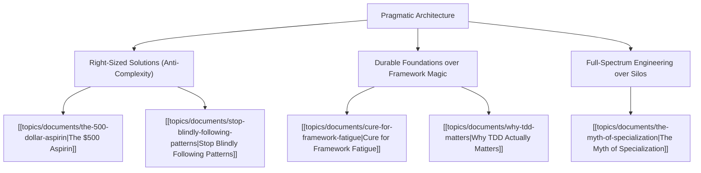

# Theme: Pragmatic Architecture & Systems Thinking

## 🗺️ Theme Mind Map

---

## 📚 Related Document Vaults

<!-- prettier-ignore-start -->
<!-- markdownlint-disable MD013 -->
| Document Title                                                                        | ID        | Pillar                 | Status   | Core Angle / Contribution to Theme                                                                      |
| :------------------------------------------------------------------------------------ | :-------- | :--------------------- | :------- | :------------------------------------------------------------------------------------------------------ |
| [[topics/documents/the-500-dollar-aspirin\|The $500 Aspirin]]                         | `TOP-001` | Org Culture            | Outlined | Avoid multi-million dollar over-engineering when a lightweight pragmatic solution solves the real pain. |
| [[topics/documents/cure-for-framework-fatigue\|Cure for Framework Fatigue]]           | `TOP-005` | Pragmatic Architecture | Outlined | Building architectural boundaries that isolate vendor churn and runtime dependencies.                   |
| [[topics/documents/stop-blindly-following-patterns\|Stop Blindly Following Patterns]] | `TOP-012` | Pragmatic Architecture | Outlined | Rejecting cargo-cult design patterns when simple procedural or modular code suffices.                   |
| [[topics/documents/why-tdd-matters\|Why TDD Actually Matters]]                        | `TOP-007` | Pragmatic Architecture | Outlined | How testing forces decoupled, modular architecture rather than being just a QA check.                   |
| [[topics/documents/the-myth-of-specialization\|The Myth of Specialization]]           | `TOP-014` | Pragmatic Architecture | Outlined | Why generalist systems thinkers create more resilient architectures than hyper-specialists.             |

|
[[topics/documents/series-the-zero-dependency-web\|Series: The Zero-Dependency & Zero-Framework Web]]
| `TOP-015` | Pragmatic Architecture | Outlined | How modern Web Standards combined with local AI
skills make 90% of runtime frame... | |
[[topics/documents/the-framework-tax\|The Framework Tax: Why Modern Web Abstractions Cost More Than They Deliver]]
| `TOP-016` | Pragmatic Architecture | Outlined | Frameworks were invented for human cognitive
limitations, but impose an ongoing ... | |
[[topics/documents/ai-as-the-ultimate-transpiler\|AI as the Ultimate Transpiler: Why We No Longer Need Giant Runtime Bundles]]
| `TOP-017` | Pragmatic Architecture | Outlined | When an AI agent can generate clean, bespoke
vanilla code and local helpers in s... | |
[[topics/documents/npm-for-ai-skills-not-packages\|NPM for AI Skills: Distributing Agent Capabilities Instead of Bloated Code]]
| `TOP-019` | Pragmatic Architecture | Outlined | The future package manager will distribute
composable agent rules, skills, and p... | |
[[topics/documents/bespoke-build-tooling-on-the-fly\|Bespoke Build Tooling on the Fly: Moving Beyond Monolithic Bundlers]]
| `TOP-021` | Pragmatic Architecture | Outlined | Ephemeral, AI-generated build scripts tailored
precisely to a project eliminate ... | |
[[topics/documents/supply-chain-security-by-elimination\|Supply Chain Security by Elimination: Why Fewer Dependencies Mean Fewer CVEs]]
| `TOP-023` | Pragmatic Architecture | Outlined | The single most effective software security
strategy is eliminating unvetted thi... | |
[[topics/documents/benchmarking-zero-framework-performance\|Benchmarking Zero-Framework Performance: Real-World Core Web Vitals]]
| `TOP-024` | Pragmatic Architecture | Outlined | Shipping zero framework runtime yields instant
sub-50ms Interaction to Next Pain... | |
[[topics/documents/crowdsourcing-price-telemetry\|Crowdsourcing Price Telemetry: Building the Distributed Consumer Watchdog]]
| `TOP-027` | Consumer Advocacy & Ethics | Outlined | An open-source browser extension network can
aggregate real-time price quotes an... | |
[[topics/documents/series-ai-developer-telemetry\|Series: AI Developer Telemetry & Real-World Failure Modes]]
| `TOP-032` | AI Engineering & Tooling | Outlined | Aggregating real developer failure cases and
error telemetry is the only reliabl... | |
[[topics/documents/series-the-automated-code-pruner\|Series: The Automated Code Pruner & Dead Baggage Purge]]
| `TOP-039` | Technical Debt & Maintainability | Outlined | AI agents should not just write new
code; their highest ROI role is actively aud... | |
[[topics/documents/the-zombie-code-audit\|The Zombie Code Audit: Tracing Orphaned Helpers, Routes, and Schemas with AI]]
| `TOP-041` | Technical Debt & Maintainability | Outlined | Static AST analysis combined with
semantic LLM inspection can trace full call gr... | |
[[topics/documents/feature-sunset-automation\|Feature Sunset Automation: Cleanly Deprecating Features Across the Stack]]
| `TOP-042` | Technical Debt & Maintainability | Outlined | Sunset should be an automated
first-class pipeline that purges API endpoints, UI... | |
[[topics/documents/why-smaller-codebases-win\|Why Smaller Codebases Win: The Mathematical Edge of Compact Repositories]]
| `TOP-043` | Technical Debt & Maintainability | Outlined | Compact codebases fit entirely into AI
context windows, build in seconds, and ha... | |
[[topics/documents/series-living-requirements-ai-traceability\|Series: Living Requirements & End-to-End AI Traceability]]
| `TOP-045` | Product & Requirements Engineering | Outlined | Bridging the fatal divide between
business intent, PRDs, and production code usi... | |
[[topics/documents/bidirectional-traceability-with-ai\|Bidirectional Traceability with AI: Linking Every Test to Business Intent]]
| `TOP-047` | Product & Requirements Engineering | Outlined | AI agents can maintain real-time
bidirectional links between user stories, unit ... | |
[[topics/documents/the-tracer-bullet-spec\|The Tracer Bullet Spec: Writing Minimal Requirements for AI Execution]]
| `TOP-049` | Product & Requirements Engineering | Outlined | Writing thin, end-to-end vertical
slice specifications allows AI agents to build... | |
[[topics/documents/the-intp-architecture-instinct\|The INTP Architecture Instinct: First Principles Over Industry Dogma]]
| `TOP-053` | Neurodiversity & Mindset | Outlined | The INTP drive to dismantle concepts to their
bare logical roots is the antidote... | |
[[topics/documents/consultation-vs-debate\|Consultation vs. Debate: Making Architectural Decisions Without Ego Battles]]
| `TOP-059` | Culture & Leadership | Outlined | In debate, people defend their ideas like territory;
in true consultation, an id... | |
[[topics/documents/the-curse-of-knowledge\|The Curse of Knowledge: Why Senior Architects Struggle to Explain Ideas Simply]]
| `TOP-075` | Communication & Storytelling | Outlined | The more you know, the harder it is to
remember what it was like not knowing; gr... | |
[[topics/documents/the-story-spine-for-software-architecture\|The Story Spine for Tech: Structuring Technical Decisions as Narrative Arcs]]
| `TOP-079` | Communication & Storytelling | Outlined | Every technical proposal should follow
classic storytelling: Status Quo -> The C... | |
[[topics/documents/series-the-context-aware-time-tracker\|Series: The Context-Aware Time Tracker & Anti-Nag Productivity]]
| `TOP-081` | Tools & ADHD Productivity | Outlined | Traditional productivity apps fail ADHD brains
through alarm fatigue and intrusi... | |
[[topics/documents/designing-for-non-intrusive-presence\|Designing for Non-Intrusive Presence: Surfacing Information at Natural Transition Moments]]
| `TOP-084` | Tools & ADHD Productivity | Outlined | Ambient UI and transition-moment detection
allow tools to present critical deadl... | |
[[topics/documents/architecture-of-a-local-first-context-engine\|Architecture of a Local-First Context Engine: Privacy, Integration, and AI]]
| `TOP-087` | Tools & ADHD Productivity | Outlined | A personal context orchestrator must be
local-first, storing sensitive calendar ... | |
[[topics/documents/agility-vs-scale\|Agility vs. Scale: Why Giant Corporations Cannot Pivot to Niche Demand]]
| `TOP-092` | Future Economy & Manufacturing | Outlined | Corporate overhead and multi-layer
management create institutional inertia, leav... | |
| [[topics/documents/breaking-the-iron-triangle-practical-automation\|Breaking the Iron Triangle: Practical Automation and the Triple-Win Formula]] | `TOP-102` | Pragmatic Architecture | Outlined | Proving that practical automation simultaneously optimizes Speed, Cost, and Quality, breaking the Iron Triangle myth. |
<!-- markdownlint-restore -->
<!-- prettier-ignore-end -->

---

## 💡 Key Theme Principles

- **Architecture is Trade-offs**: There are no good solutions, only trade-offs optimized for
  specific constraints.
- **Defer Complexity**: The best architecture is the simplest one that can cleanly evolve.
