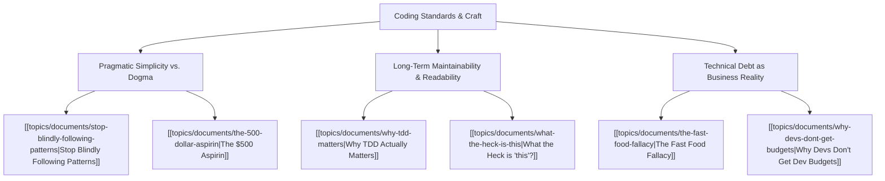

# Theme: Coding Standards & Engineering Craft

## 🗺️ Theme Mind Map

---

## 📚 Related Document Vaults

| Document Title | ID | Pillar | Status | Core Angle / Contribution to Theme |
| :--- | :--- | :--- | :--- | :--- |
| [[topics/documents/stop-blindly-following-patterns\|Stop Blindly Following Patterns]] | `TOP-012` | Pragmatic Architecture | Outlined | Clean Code dogma vs. contextual, readable, idiomatic code. |
| [[topics/documents/why-tdd-matters\|Why TDD Actually Matters]] | `TOP-007` | Pragmatic Architecture | Outlined | Fast feedback loops, modular design pressure, and refactoring safety. |
| [[topics/documents/the-500-dollar-aspirin\|The $500 Aspirin]] | `TOP-001` | Org Culture | Outlined | Solving the right problem simply instead of engineering an over-scoped enterprise solution. |
| [[topics/documents/the-fast-food-fallacy\|The Fast Food Fallacy]] | `TOP-006` | Org Culture | Outlined | The true compound cost of "quick and dirty" code hacks. |
| [[topics/documents/why-devs-dont-get-budgets\|Why Devs Don't Get Dev Budgets]] | `TOP-013` | Org Culture | Outlined | Translating coding standards and refactoring value into executive ROI language. |

---

## 💡 Key Theme Principles
- **Readability over Cleverness**: Code is read 10x more often than it is written.
- **Context over Dogma**: A pattern is only useful if it reduces cognitive load for the team maintaining it.
