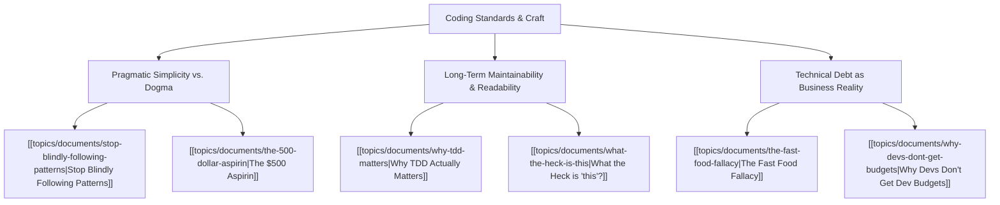

# Theme: Coding Standards & Engineering Craft

## 🗺️ Theme Mind Map

---

## 📚 Related Document Vaults

<!-- prettier-ignore-start -->
<!-- markdownlint-disable MD013 -->
| Document Title                                                                        | ID        | Pillar                 | Status   | Core Angle / Contribution to Theme                                                          |
| :------------------------------------------------------------------------------------ | :-------- | :--------------------- | :------- | :------------------------------------------------------------------------------------------ |
| [[topics/documents/stop-blindly-following-patterns\|Stop Blindly Following Patterns]] | `TOP-012` | Pragmatic Architecture | Outlined | Clean Code dogma vs. contextual, readable, idiomatic code.                                  |
| [[topics/documents/why-tdd-matters\|Why TDD Actually Matters]]                        | `TOP-007` | Pragmatic Architecture | Outlined | Fast feedback loops, modular design pressure, and refactoring safety.                       |
| [[topics/documents/the-500-dollar-aspirin\|The $500 Aspirin]]                         | `TOP-001` | Org Culture            | Outlined | Solving the right problem simply instead of engineering an over-scoped enterprise solution. |
| [[topics/documents/the-fast-food-fallacy\|The Fast Food Fallacy]]                     | `TOP-006` | Org Culture            | Outlined | The true compound cost of "quick and dirty" code hacks.                                     |
| [[topics/documents/why-devs-dont-get-budgets\|Why Devs Don't Get Dev Budgets]]        | `TOP-013` | Org Culture            | Outlined | Translating coding standards and refactoring value into executive ROI language.             |

|
[[topics/documents/series-the-zero-dependency-web\|Series: The Zero-Dependency & Zero-Framework Web]]
| `TOP-015` | Pragmatic Architecture | Outlined | How modern Web Standards combined with local AI
skills make 90% of runtime frame... | |
[[topics/documents/the-zero-dependency-web-stack\|The Zero-Dependency Web Stack: Web Components, CSS Grid, and Native APIs]]
| `TOP-018` | Pragmatic Architecture | Outlined | Modern browser standards (Web Components, CSS
Grid/Subgrid, View Transitions, Di... | |
[[topics/documents/the-cognitive-load-inversion\|The Cognitive Load Inversion: Shifting from Framework APIs to Platform Primitives]]
| `TOP-022` | Pragmatic Architecture | Outlined | Mastering foundational platform primitives has a
20-year half-life; mastering fr... | |
[[topics/documents/supply-chain-security-by-elimination\|Supply Chain Security by Elimination: Why Fewer Dependencies Mean Fewer CVEs]]
| `TOP-023` | Pragmatic Architecture | Outlined | The single most effective software security
strategy is eliminating unvetted thi... | |
[[topics/documents/anatomy-of-ai-hallucinations-in-code\|Anatomy of an AI Hallucination: The 5 Most Dangerous Code Generation Traps]]
| `TOP-033` | AI Engineering & Tooling | Outlined | AI code errors are not random; they cluster
around phantom library methods, shal... | |
[[topics/documents/the-looks-right-trap\|The 'Looks Right' Trap: Why Subtle Logic Bugs Are 10x Worse Than Syntax Errors]]
| `TOP-034` | AI Engineering & Tooling | Outlined | Compilers catch broken syntax instantly, but
clean-looking AI code with flawed b... | |
[[topics/documents/benchmarking-ai-guardrails\|Benchmarking AI Guardrails: Measuring What Actually Prevents Code Rot]]
| `TOP-035` | AI Engineering & Tooling | Outlined | Rigorous testing of skill files and prompt
constraints reveals that short, deter... | |
[[topics/documents/privacy-respecting-developer-telemetry\|Privacy-Respecting Developer Telemetry: Sharing Failure Data Safely]]
| `TOP-036` | AI Engineering & Tooling | Outlined | We can build IDE plugins that redact proprietary
code while capturing abstracted... | |
[[topics/documents/the-developer-scar-tissue-index\|The Developer Scar-Tissue Index: Converting Production Bugs into Agent Skills]]
| `TOP-038` | AI Engineering & Tooling | Outlined | Every post-mortem and production outage should
produce an immutable agent rule o... | |
[[topics/documents/series-the-automated-code-pruner\|Series: The Automated Code Pruner & Dead Baggage Purge]]
| `TOP-039` | Technical Debt & Maintainability | Outlined | AI agents should not just write new
code; their highest ROI role is actively aud... | |
[[topics/documents/the-psychology-of-deleting-code\|The Psychology of Deleting Code: Overcoming the Fear of the Backspace Key]]
| `TOP-040` | Technical Debt & Maintainability | Outlined | Engineers suffer from sunk-cost fallacy
regarding legacy code; real architectura... | |
[[topics/documents/the-zombie-code-audit\|The Zombie Code Audit: Tracing Orphaned Helpers, Routes, and Schemas with AI]]
| `TOP-041` | Technical Debt & Maintainability | Outlined | Static AST analysis combined with
semantic LLM inspection can trace full call gr... | |
[[topics/documents/feature-sunset-automation\|Feature Sunset Automation: Cleanly Deprecating Features Across the Stack]]
| `TOP-042` | Technical Debt & Maintainability | Outlined | Sunset should be an automated
first-class pipeline that purges API endpoints, UI... | |
[[topics/documents/the-boy-scout-rule-for-ai-agents\|The Boy Scout Rule for AI Agents: Leaving Every File Cleaner Than Found]]
| `TOP-044` | Technical Debt & Maintainability | Outlined | Embedding pruning instructions in agent
system prompts ensures that every featur... | |
[[topics/documents/bidirectional-traceability-with-ai\|Bidirectional Traceability with AI: Linking Every Test to Business Intent]]
| `TOP-047` | Product & Requirements Engineering | Outlined | AI agents can maintain real-time
bidirectional links between user stories, unit ... | |
[[topics/documents/requirements-as-executable-constraints\|Requirements as Executable Constraints: Turning PRDs into Agent Guardrails]]
| `TOP-048` | Product & Requirements Engineering | Outlined | Static markdown PRDs should be parsed
by AI directly into executable unit tests ... | |
[[topics/documents/the-dopamine-driven-refactor\|The Dopamine-Driven Refactor: Channeling ADHD Energy into Clean Codebases]]
| `TOP-055` | Neurodiversity & Mindset | Outlined | Cleaning up tangled code and deleting dead
modules provides intense dopamine rew... | |
[[topics/documents/psychological-safety-in-code-reviews\|Psychological Safety in Code Reviews: Critique the Code, Elevate the Person]]
| `TOP-061` | Culture & Leadership | Outlined | Code reviews should be celebratory mentorship
rituals that build confidence, not... | |
[[topics/documents/building-a-blameless-post-mortem-culture\|Building a Blameless Post-Mortem Culture: Learning from Production Outages]]
| `TOP-064` | Culture & Leadership | Outlined | When outages happen, blaming individuals guarantees
future incidents will be hid... | |
[[topics/documents/open-source-as-the-new-interview\|Open Source as the New Interview: Real Contributions Over LeetCode Trivia]]
| `TOP-070` | Career & Hiring Realities | Outlined | Merging a clean pull request into an
established open-source repo demonstrates c... |
<!-- markdownlint-restore -->
<!-- prettier-ignore-end -->

---

## 💡 Key Theme Principles

- **Readability over Cleverness**: Code is read 10x more often than it is written.
- **Context over Dogma**: A pattern is only useful if it reduces cognitive load for the team
  maintaining it.
