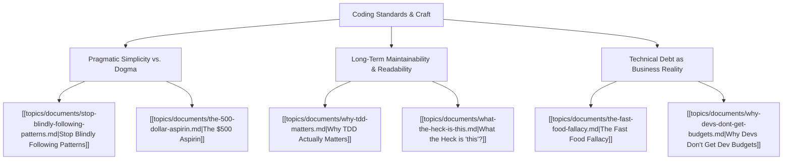

# Theme: Coding Standards & Engineering Craft

## Metadata
- **Theme Name**: Coding Standards & Engineering Craft
- **Category**: Software Engineering & Best Practices
- **Related Themes**: [[topics/themes/architecture.md|Pragmatic Architecture]], [[topics/themes/testing-quality.md|Testing & Quality]], [[topics/themes/leadership-culture.md|Org Culture & Leadership]]

---

## 🗺️ Theme Mind Map

---

## 📚 Related Document Vaults

| Document Title | ID | Pillar | Status | Core Angle / Contribution to Theme |
| :--- | :--- | :--- | :--- | :--- |
| [Stop Blindly Following Patterns](topics/documents/stop-blindly-following-patterns.md) | `TOP-012` | Pragmatic Architecture | Outlined | Clean Code dogma vs. contextual, readable, idiomatic code. |
| [Why TDD Actually Matters](topics/documents/why-tdd-matters.md) | `TOP-007` | Pragmatic Architecture | Outlined | Fast feedback loops, modular design pressure, and refactoring safety. |
| [The $500 Aspirin](topics/documents/the-500-dollar-aspirin.md) | `TOP-001` | Org Culture | Outlined | Solving the right problem simply instead of engineering an over-scoped enterprise solution. |
| [The Fast Food Fallacy](topics/documents/the-fast-food-fallacy.md) | `TOP-006` | Org Culture | Outlined | The true compound cost of "quick and dirty" code hacks. |
| [Why Devs Don't Get Dev Budgets](topics/documents/why-devs-dont-get-budgets.md) | `TOP-013` | Org Culture | Outlined | Translating coding standards and refactoring value into executive ROI language. |

---

## 💡 Key Theme Principles
- **Readability over Cleverness**: Code is read 10x more often than it is written.
- **Context over Dogma**: A pattern is only useful if it reduces cognitive load for the team maintaining it.
