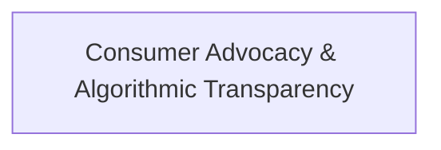

# Theme: Consumer Advocacy & Algorithmic Transparency

## 🗺️ Theme Mind Map

---

## 📚 Related Document Vaults

<!-- prettier-ignore-start -->
<!-- markdownlint-disable MD013 -->
| Document Title | ID  | Pillar | Status | Core Angle / Contribution to Theme |
| :------------- | :-- | :----- | :----- | :--------------------------------- |

|
[[topics/documents/series-the-anti-surveillance-consumer\|Series: The Anti-Surveillance Consumer & Algorithmic Transparency]]
| `TOP-025` | Consumer Advocacy & Ethics | Outlined | How crowdsourced telemetry and open browser
tools can expose predatory algorithm... | |
[[topics/documents/surveillance-pricing-mechanics\|Surveillance Pricing Mechanics: How Retailers Weaponize Your Digital Exhaust]]
| `TOP-026` | Consumer Advocacy & Ethics | Outlined | Retailers use battery level, zip code, device
type, and purchase velocity to cal... | |
[[topics/documents/crowdsourcing-price-telemetry\|Crowdsourcing Price Telemetry: Building the Distributed Consumer Watchdog]]
| `TOP-027` | Consumer Advocacy & Ethics | Outlined | An open-source browser extension network can
aggregate real-time price quotes an... | |
[[topics/documents/the-modern-consumer-reports\|The Modern Consumer Reports: Reinventing Investigative Advocacy for the AI Era]]
| `TOP-028` | Consumer Advocacy & Ethics | Outlined | The 1980s investigative journalism model of
Consumer Reports must be reborn as r... | |
[[topics/documents/coordinated-consumer-leverage\|Coordinated Consumer Leverage: Turning Transparency into Actionable Boycotts]]
| `TOP-029` | Consumer Advocacy & Ethics | Outlined | Individual consumers are powerless against
trillion-dollar algorithms, but coord... | |
[[topics/documents/poisoning-the-price-tracker\|Poisoning the Price Tracker: Techniques to Break Algorithmic Profiling]]
| `TOP-030` | Consumer Advocacy & Ethics | Outlined | Injecting synthetic digital noise and
randomized purchasing signals degrades the... | |
[[topics/documents/the-regulatory-void-in-dynamic-pricing\|The Regulatory Void: Why Antitrust Laws Fail at Micro-Targeted Extraction]]
| `TOP-031` | Consumer Advocacy & Ethics | Outlined | Current antitrust framework focuses on broad
price-fixing between competitors, c... | |
[[topics/documents/promoting-the-independent-maker\|Promoting the Independent Maker: Why the Future Belongs to Specialized Artisans]]
| `TOP-091` | Future Economy & Manufacturing | Outlined | Modern CAD, AI design assistants, and
digital fabrication empower solo artisans ... |
<!-- markdownlint-restore -->
<!-- prettier-ignore-end -->

---

## 💡 Key Theme Principles

- **Systems-Level Understanding**: Ground technical and cultural topics in first principles.
- **Durable Foundations**: Focus on long-term human and architectural flourishing over transient
  hype.
