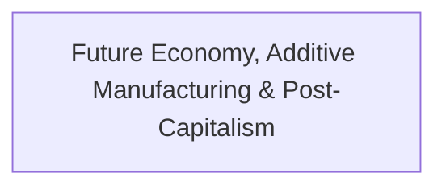

# Theme: Future Economy, Additive Manufacturing & Post-Capitalism

## 🗺️ Theme Mind Map

---

## 📚 Related Document Vaults

<!-- prettier-ignore-start -->
<!-- markdownlint-disable MD013 -->
| Document Title | ID  | Pillar | Status | Core Angle / Contribution to Theme |
| :------------- | :-- | :----- | :----- | :--------------------------------- |

|
[[topics/documents/series-post-mass-production-economy\|Series: The Post-Mass Production Economy & Local Precision]]
| `TOP-088` | Future Economy & Manufacturing | Outlined | The era of rigid global mass production is
giving way to localized additive manu... | |
[[topics/documents/the-sunset-of-mass-production\|The Sunset of Mass Production: Why Rigid Supply Chains Fail Modern Needs]]
| `TOP-089` | Future Economy & Manufacturing | Outlined | Mass production demands massive upfront
tooling and massive minimum runs, creati... | |
[[topics/documents/the-rise-of-micro-scale-precision\|The Rise of Micro-Scale Precision: How 3D Printing and Local Fab Win]]
| `TOP-090` | Future Economy & Manufacturing | Outlined | High-precision additive manufacturing
enables zero-tooling production, making cu... | |
[[topics/documents/promoting-the-independent-maker\|Promoting the Independent Maker: Why the Future Belongs to Specialized Artisans]]
| `TOP-091` | Future Economy & Manufacturing | Outlined | Modern CAD, AI design assistants, and
digital fabrication empower solo artisans ... | |
[[topics/documents/agility-vs-scale\|Agility vs. Scale: Why Giant Corporations Cannot Pivot to Niche Demand]]
| `TOP-092` | Future Economy & Manufacturing | Outlined | Corporate overhead and multi-layer
management create institutional inertia, leav... | |
[[topics/documents/series-the-evolution-beyond-extractive-capitalism\|Series: The Evolution Beyond Extractive Capitalism & The Myth of Self-Interest]]
| `TOP-093` | Economics, Society & Ethics | Outlined | Short-term executive extraction, insular
optimization, and zero-marginal-cost AI... | |
[[topics/documents/the-myth-of-enlightened-self-interest\|The Myth of Enlightened Self-Interest: Why the 'Invisible Hand' Is Broken]]
| `TOP-094` | Economics, Society & Ethics | Outlined | When corporate structures insulate
decision-makers from the societal harm of the... | |
[[topics/documents/the-five-month-tenure-trap\|The 5-Month Tenure Trap: How Executive Incentives Destroy Long-Term Enterprise Value]]
| `TOP-095` | Economics, Society & Ethics | Outlined | Transient executives are incentivized to
slash R&D, lay off key talent, pump sho... | |
[[topics/documents/when-extraction-replaces-value-creation\|When Extraction Replaces Value Creation: The Late-Stage Corporate Playbook]]
| `TOP-097` | Economics, Society & Ethics | Outlined | When companies run out of genuine
innovations, they pivot to financial engineeri... | |
[[topics/documents/ai-and-the-post-labor-economy\|AI and the Post-Labor Economy: Why Capital vs. Labor Economics Must Evolve]]
| `TOP-098` | Economics, Society & Ethics | Outlined | When cognitive labor reaches near-zero
marginal cost, the foundational premise o... | |
[[topics/documents/bahai-principles-and-economic-unity\|Bahá’í Principles & Economic Unity: A Blueprint for Long-Term Stewardship]]
| `TOP-099` | Economics, Society & Ethics | Outlined | Integrating spiritual principles—voluntary
profit-sharing, consultation, elimina... | |
[[topics/documents/building-sustainable-alternatives-today\|Building Sustainable Alternatives Today: Operating Outside the Extractive Playbook]]
| `TOP-100` | Economics, Society & Ethics | Outlined | Engineers and creators do not have to wait
for global policy; we can build worke... |
<!-- markdownlint-restore -->
<!-- prettier-ignore-end -->

---

## 💡 Key Theme Principles

- **Systems-Level Understanding**: Ground technical and cultural topics in first principles.
- **Durable Foundations**: Focus on long-term human and architectural flourishing over transient
  hype.
