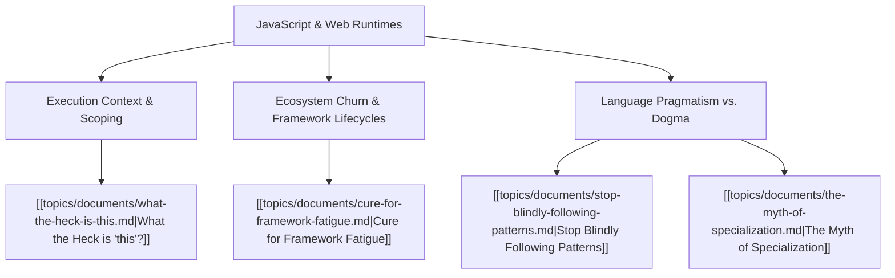

# Theme: JavaScript & Web Runtimes

## Metadata
- **Theme Name**: JavaScript & Web Runtimes
- **Category**: Software Engineering & Language Mechanics
- **Related Themes**: [[topics/themes/typescript.md|TypeScript]], [[topics/themes/coding-standards.md|Coding Standards]], [[topics/themes/architecture.md|Pragmatic Architecture]]

---

## 🗺️ Theme Mind Map

---

## 📚 Related Document Vaults

| Document Title | ID | Pillar | Status | Core Angle / Contribution to Theme |
| :--- | :--- | :--- | :--- | :--- |
| [What the Heck is "this"?](topics/documents/what-the-heck-is-this.md) | `TOP-002` | Pragmatic Architecture | Outlined | Deep mechanical breakdown of JavaScript execution context, call-site binding, arrow functions, and prototype chains. |
| [Cure for Framework Fatigue](topics/documents/cure-for-framework-fatigue.md) | `TOP-005` | Pragmatic Architecture | Outlined | Navigating the relentless churn of JS frameworks by mastering fundamentals, Web APIs, and durable primitives. |
| [Stop Blindly Following Patterns](topics/documents/stop-blindly-following-patterns.md) | `TOP-012` | Pragmatic Architecture | Outlined | Avoiding over-engineered OOP and GoF dogma in idiomatic JavaScript and TypeScript codebases. |
| [The Myth of Specialization](topics/documents/the-myth-of-specialization.md) | `TOP-014` | Pragmatic Architecture | Outlined | Why deep frontend JS specialization is fragile compared to full-spectrum systems thinking. |

---

## 💡 Key Theme Principles
- **Master the Engine**: When you understand the runtime, event loop, and call-site mechanics, framework magic disappears.
- **Durable over Ephemeral**: Frameworks change every 24 months; Web standards and basic data structures last decades.
