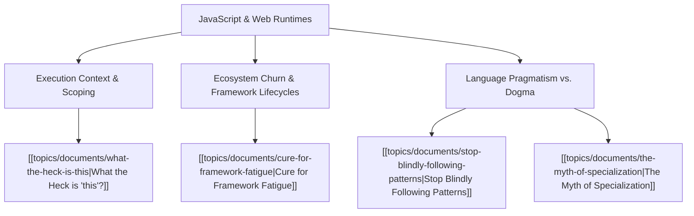

# Theme: JavaScript & Web Runtimes

## 🗺️ Theme Mind Map

---

## 📚 Related Document Vaults

| Document Title                                                                        | ID        | Pillar                 | Status   | Core Angle / Contribution to Theme                                                                                   |
| :------------------------------------------------------------------------------------ | :-------- | :--------------------- | :------- | :------------------------------------------------------------------------------------------------------------------- |
| [[topics/documents/what-the-heck-is-this\|What the Heck is "this"?]]                  | `TOP-002` | Pragmatic Architecture | Outlined | Deep mechanical breakdown of JavaScript execution context, call-site binding, arrow functions, and prototype chains. |
| [[topics/documents/cure-for-framework-fatigue\|Cure for Framework Fatigue]]           | `TOP-005` | Pragmatic Architecture | Outlined | Navigating the relentless churn of JS frameworks by mastering fundamentals, Web APIs, and durable primitives.        |
| [[topics/documents/stop-blindly-following-patterns\|Stop Blindly Following Patterns]] | `TOP-012` | Pragmatic Architecture | Outlined | Avoiding over-engineered OOP and GoF dogma in idiomatic JavaScript and TypeScript codebases.                         |
| [[topics/documents/the-myth-of-specialization\|The Myth of Specialization]]           | `TOP-014` | Pragmatic Architecture | Outlined | Why deep frontend JS specialization is fragile compared to full-spectrum systems thinking.                           |

---

## 💡 Key Theme Principles

- **Master the Engine**: When you understand the runtime, event loop, and call-site mechanics,
  framework magic disappears.
- **Durable over Ephemeral**: Frameworks change every 24 months; Web standards and basic data
  structures last decades.
