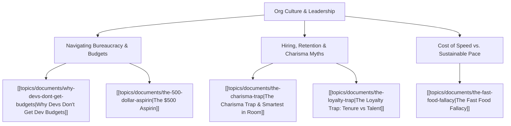

# Theme: Org Culture, Leadership & Career Wisdom

## 🗺️ Theme Mind Map

---

## 📚 Related Document Vaults

| Document Title | ID | Pillar | Status | Core Angle / Contribution to Theme |
| :--- | :--- | :--- | :--- | :--- |
| [[topics/documents/why-devs-dont-get-budgets\|Why Devs Don't Get Dev Budgets]] | `TOP-013` | Org Culture | Outlined | Bridging the communication chasm between technical refactoring and executive business value. |
| [[topics/documents/the-500-dollar-aspirin\|The $500 Aspirin]] | `TOP-001` | Org Culture | Outlined | Enterprise consulting lessons on delivering real business relief without bloated bureaucracy. |
| [[topics/documents/the-charisma-trap\|The Charisma Trap]] | `TOP-009` | Org Culture | Outlined | Differentiating magnetic presentation from authentic architectural competence and deep leadership. |
| [[topics/documents/the-loyalty-trap\|The Loyalty Trap]] | `TOP-008` | Org Culture | Outlined | Why tenure is often rewarded over high impact and how engineers get trapped in dead-end loyalty loops. |
| [[topics/documents/the-fast-food-fallacy\|The Fast Food Fallacy]] | `TOP-006` | Org Culture | Outlined | How executive pressure for "instant delivery" creates toxic engineering environments and technical bankruptcy. |

---

## 💡 Key Theme Principles
- **Speak in Business Outcomes**: If you can't explain technical investments in terms of risk, revenue, or velocity, you won't get funded.
- **Look Past the Shine**: The loudest voice in the room is rarely the deepest thinker.
