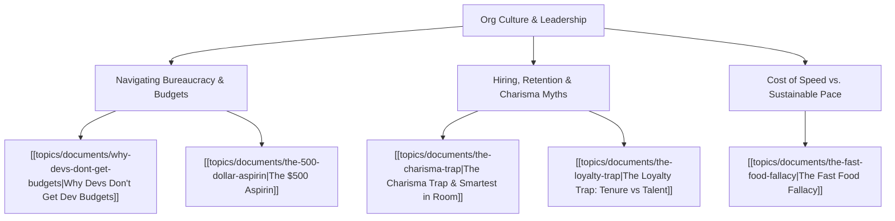

# Theme: Org Culture, Leadership & Career Wisdom

## 🗺️ Theme Mind Map

---

## 📚 Related Document Vaults

<!-- prettier-ignore-start -->
<!-- markdownlint-disable MD013 -->
| Document Title                                                                 | ID        | Pillar      | Status   | Core Angle / Contribution to Theme                                                                             |
| :----------------------------------------------------------------------------- | :-------- | :---------- | :------- | :------------------------------------------------------------------------------------------------------------- |
| [[topics/documents/why-devs-dont-get-budgets\|Why Devs Don't Get Dev Budgets]] | `TOP-013` | Org Culture | Outlined | Bridging the communication chasm between technical refactoring and executive business value.                   |
| [[topics/documents/the-500-dollar-aspirin\|The $500 Aspirin]]                  | `TOP-001` | Org Culture | Outlined | Enterprise consulting lessons on delivering real business relief without bloated bureaucracy.                  |
| [[topics/documents/the-charisma-trap\|The Charisma Trap]]                      | `TOP-009` | Org Culture | Outlined | Differentiating magnetic presentation from authentic architectural competence and deep leadership.             |
| [[topics/documents/the-loyalty-trap\|The Loyalty Trap]]                        | `TOP-008` | Org Culture | Outlined | Why tenure is often rewarded over high impact and how engineers get trapped in dead-end loyalty loops.         |
| [[topics/documents/the-fast-food-fallacy\|The Fast Food Fallacy]]              | `TOP-006` | Org Culture | Outlined | How executive pressure for "instant delivery" creates toxic engineering environments and technical bankruptcy. |

|
[[topics/documents/the-cognitive-load-inversion\|The Cognitive Load Inversion: Shifting from Framework APIs to Platform Primitives]]
| `TOP-022` | Pragmatic Architecture | Outlined | Mastering foundational platform primitives has a
20-year half-life; mastering fr... | |
[[topics/documents/the-psychology-of-deleting-code\|The Psychology of Deleting Code: Overcoming the Fear of the Backspace Key]]
| `TOP-040` | Technical Debt & Maintainability | Outlined | Engineers suffer from sunk-cost fallacy
regarding legacy code; real architectura... | |
[[topics/documents/series-living-requirements-ai-traceability\|Series: Living Requirements & End-to-End AI Traceability]]
| `TOP-045` | Product & Requirements Engineering | Outlined | Bridging the fatal divide between
business intent, PRDs, and production code usi... | |
[[topics/documents/the-ghost-requirement-epidemic\|The Ghost Requirement Epidemic: How Features Drift from Intent to PR]]
| `TOP-046` | Product & Requirements Engineering | Outlined | Features inevitably drift across
handoffs (Product -> Jira -> Design -> Code); w... | |
[[topics/documents/why-standups-fail-adhd-brains\|Why Daily Standups and Sprint Ceremonies Fail Neurodivergent Engineers]]
| `TOP-056` | Neurodiversity & Mindset | Outlined | Rigid, synchronized agile rituals shatter
hyperfocus states; async communication... | |
[[topics/documents/series-workplace-unity-and-consultation\|Series: Workplace Unity, Consultation & Blameless Culture]]
| `TOP-058` | Culture & Leadership | Outlined | Applying principle-centered consultation to
engineering teams replaces destructi... | |
[[topics/documents/consultation-vs-debate\|Consultation vs. Debate: Making Architectural Decisions Without Ego Battles]]
| `TOP-059` | Culture & Leadership | Outlined | In debate, people defend their ideas like territory;
in true consultation, an id... | |
[[topics/documents/the-myth-of-the-10x-jerk\|The Myth of the 10x Jerk: Why Team Unity Always Outperforms Isolated Genius]]
| `TOP-060` | Culture & Leadership | Outlined | A toxic high-performer creates systemic negative
externalities—fear, turnover, w... | |
[[topics/documents/psychological-safety-in-code-reviews\|Psychological Safety in Code Reviews: Critique the Code, Elevate the Person]]
| `TOP-061` | Culture & Leadership | Outlined | Code reviews should be celebratory mentorship
rituals that build confidence, not... | |
[[topics/documents/servant-leadership-in-engineering\|Servant Leadership in Engineering: The Leader as Chief Roadblock Remover]]
| `TOP-062` | Culture & Leadership | Outlined | True authority in engineering is earned through
humble service, shield-bearing a... | |
[[topics/documents/navigating-tech-layoffs-with-solidarity\|Navigating Tech Layoffs with Solidarity: Empathy in Times of Corporate Contraction]]
| `TOP-063` | Culture & Leadership | Outlined | Layoffs reveal the true soul of a company; treating
departing colleagues with di... | |
[[topics/documents/building-a-blameless-post-mortem-culture\|Building a Blameless Post-Mortem Culture: Learning from Production Outages]]
| `TOP-064` | Culture & Leadership | Outlined | When outages happen, blaming individuals guarantees
future incidents will be hid... | |
[[topics/documents/series-the-broken-tech-hiring-market\|Series: The Broken Tech Hiring Market & Standing Out in 2026]]
| `TOP-065` | Career & Hiring Realities | Outlined | With automated ATS filters, ghost listings, and
AI-inflated resumes, traditional... | |
[[topics/documents/ageism-and-seniority-in-modern-tech\|Ageism and Seniority in Tech: Navigating the 2026 Labor Market with 20+ Years Experience]]
| `TOP-068` | Career & Hiring Realities | Outlined | Senior engineers face unspoken age and salary
biases; reframing 20 years of expe... | |
[[topics/documents/series-the-engineers-guide-to-storytelling\|Series: The Engineer’s Guide to Public Storytelling & Non-Captive Audiences]]
| `TOP-073` | Communication & Storytelling | Outlined | Moving from internal team communication to
public writing requires unlearning ja... | |
[[topics/documents/the-five-month-tenure-trap\|The 5-Month Tenure Trap: How Executive Incentives Destroy Long-Term Enterprise Value]]
| `TOP-095` | Economics, Society & Ethics | Outlined | Transient executives are incentivized to
slash R&D, lay off key talent, pump sho... | |
[[topics/documents/the-contagion-of-transient-debt\|The Contagion of Transient Debt: Moving from One Broken Company to Another]]
| `TOP-096` | Economics, Society & Ethics | Outlined | Because short-term executive churn is
ubiquitous, engineers hopping between comp... | |
[[topics/documents/building-sustainable-alternatives-today\|Building Sustainable Alternatives Today: Operating Outside the Extractive Playbook]]
| `TOP-100` | Economics, Society & Ethics | Outlined | Engineers and creators do not have to wait
for global policy; we can build worke... |
<!-- markdownlint-restore -->
<!-- prettier-ignore-end -->

---

## 💡 Key Theme Principles

- **Speak in Business Outcomes**: If you can't explain technical investments in terms of risk,
  revenue, or velocity, you won't get funded.
- **Look Past the Shine**: The loudest voice in the room is rarely the deepest thinker.
