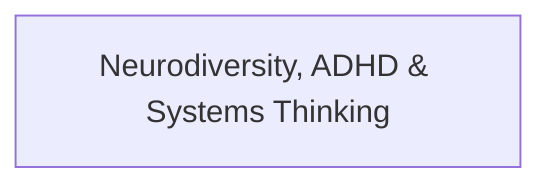

# Theme: Neurodiversity, ADHD & Systems Thinking

## 🗺️ Theme Mind Map

---

## 📚 Related Document Vaults

<!-- prettier-ignore-start -->
<!-- markdownlint-disable MD013 -->
| Document Title | ID  | Pillar | Status | Core Angle / Contribution to Theme |
| :------------- | :-- | :----- | :----- | :--------------------------------- |

|
[[topics/documents/series-neurodiversity-and-systems-thinking\|Series: Neurodiversity, ADHD & Systems Thinking in Tech]]
| `TOP-050` | Neurodiversity & Mindset | Outlined | How ADHD and INTP cognitive wiring provide
unique superpowers for complex system... | |
[[topics/documents/the-hyperfocus-advantage\|The Hyperfocus Advantage: How ADHD Engineers Build Complex Systems]]
| `TOP-051` | Neurodiversity & Mindset | Outlined | Hyperfocus is not a deficit of attention, but an
intense state of high-bandwidth... | |
[[topics/documents/working-memory-offloading-with-ai\|Working Memory Offloading: Using AI Agents as an External Cognitive Exoskeleton]]
| `TOP-052` | Neurodiversity & Mindset | Outlined | AI agents allow neurodivergent engineers to
offload working memory constraints, ... | |
[[topics/documents/the-intp-architecture-instinct\|The INTP Architecture Instinct: First Principles Over Industry Dogma]]
| `TOP-053` | Neurodiversity & Mindset | Outlined | The INTP drive to dismantle concepts to their
bare logical roots is the antidote... | |
[[topics/documents/breaking-analysis-paralysis\|Breaking Analysis Paralysis: Using AI as a Low-Stakes Sparring Partner]]
| `TOP-054` | Neurodiversity & Mindset | Outlined | ADHD task initiation friction disappears when
you can talk through messy thought... | |
[[topics/documents/the-dopamine-driven-refactor\|The Dopamine-Driven Refactor: Channeling ADHD Energy into Clean Codebases]]
| `TOP-055` | Neurodiversity & Mindset | Outlined | Cleaning up tangled code and deleting dead
modules provides intense dopamine rew... | |
[[topics/documents/why-standups-fail-adhd-brains\|Why Daily Standups and Sprint Ceremonies Fail Neurodivergent Engineers]]
| `TOP-056` | Neurodiversity & Mindset | Outlined | Rigid, synchronized agile rituals shatter
hyperfocus states; async communication... | |
[[topics/documents/building-an-obsidian-second-brain\|Building a Second Brain in Markdown: The Non-Linear Knowledge Vault]]
| `TOP-057` | Neurodiversity & Mindset | Outlined | Bi-directional markdown linking in Obsidian
matches the associative, non-linear ... | |
[[topics/documents/series-the-context-aware-time-tracker\|Series: The Context-Aware Time Tracker & Anti-Nag Productivity]]
| `TOP-081` | Tools & ADHD Productivity | Outlined | Traditional productivity apps fail ADHD brains
through alarm fatigue and intrusi... | |
[[topics/documents/why-time-trackers-fail-adhd-brains\|Why Traditional Time Trackers Fail ADHD Brains: Alarm Fatigue and Nag-Blindness]]
| `TOP-082` | Tools & ADHD Productivity | Outlined | When reminders pop up indiscriminately during
deep focus or screen shares, the A... | |
[[topics/documents/the-two-selves-problem\|The 'Two Selves' Problem: Managing the Personal/Professional Boundary in Remote Work]]
| `TOP-083` | Tools & ADHD Productivity | Outlined | We are husbands, fathers, and pet owners in our
off-time and professionals durin... | |
[[topics/documents/designing-for-non-intrusive-presence\|Designing for Non-Intrusive Presence: Surfacing Information at Natural Transition Moments]]
| `TOP-084` | Tools & ADHD Productivity | Outlined | Ambient UI and transition-moment detection
allow tools to present critical deadl... | |
[[topics/documents/the-anti-nag-philosophy\|The Anti-Nag Philosophy: Letting AI Observe Context Rather Than Demand Attention]]
| `TOP-085` | Tools & ADHD Productivity | Outlined | Passive context observation (detecting IDE
activity, meeting audio, active windo... | |
[[topics/documents/the-adhd-tool-hopping-pattern\|The ADHD Tool-Hopping Pattern: Why We Build Custom Trackers Instead of Adopting Apps]]
| `TOP-086` | Tools & ADHD Productivity | Outlined | The cycle of adopting an app, outgrowing its
rigid assumptions, and building a c... |
<!-- markdownlint-restore -->
<!-- prettier-ignore-end -->

---

## 💡 Key Theme Principles

- **Systems-Level Understanding**: Ground technical and cultural topics in first principles.
- **Durable Foundations**: Focus on long-term human and architectural flourishing over transient
  hype.
