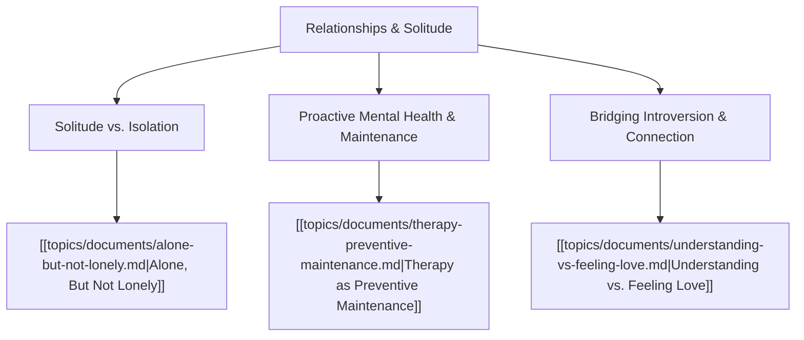

# Theme: Relationships, Introversion & Solitude

## Metadata
- **Theme Name**: Relationships, Introversion & Solitude
- **Category**: Relationships & Personal Growth
- **Related Themes**: [[topics/themes/virtue-mindset.md|Virtue & Mindset]], [[topics/themes/leadership-culture.md|Org Culture & Leadership]]

---

## 🗺️ Theme Mind Map

---

## 📚 Related Document Vaults

| Document Title | ID | Pillar | Status | Core Angle / Contribution to Theme |
| :--- | :--- | :--- | :--- | :--- |
| [Alone, But Not Lonely](topics/documents/alone-but-not-lonely.md) | `TOP-003` | Relationships & Solitude | Outlined | Deconstructing the loneliness quadrant and exploring how introverts find deep peace without social isolation. |
| [Therapy as Preventive Maintenance](topics/documents/therapy-preventive-maintenance.md) | `TOP-010` | Relationships & Solitude | Outlined | Reframing mental health care from crisis intervention to routine, disciplined psychological calibration. |
| [Understanding vs. Feeling Love](topics/documents/understanding-vs-feeling-love.md) | `TOP-011` | Spirituality & Virtue | Outlined | Love as an intentional, disciplined commitment rather than an ephemeral emotional state. |

---

## 💡 Key Theme Principles
- **Solitude is Richness; Isolation is Poverty**: Solitude recharges the self; isolation is running away from the world.
- **Maintenance Over Repair**: Taking care of your emotional and relational health before a crisis hits is the ultimate sign of strength.
