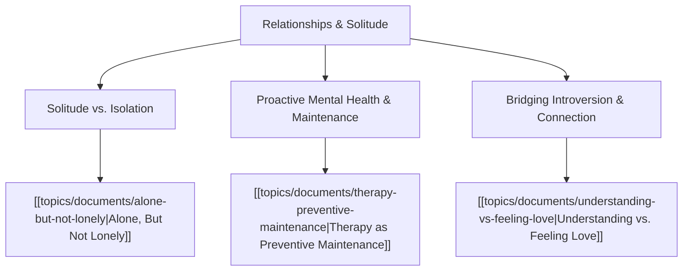

# Theme: Relationships, Introversion & Solitude

## 🗺️ Theme Mind Map

---

## 📚 Related Document Vaults

<!-- prettier-ignore-start -->
<!-- markdownlint-disable MD013 -->
| Document Title                                                                         | ID        | Pillar                   | Status   | Core Angle / Contribution to Theme                                                                            |
| :------------------------------------------------------------------------------------- | :-------- | :----------------------- | :------- | :------------------------------------------------------------------------------------------------------------ |
| [[topics/documents/alone-but-not-lonely\|Alone, But Not Lonely]]                       | `TOP-003` | Relationships & Solitude | Outlined | Deconstructing the loneliness quadrant and exploring how introverts find deep peace without social isolation. |
| [[topics/documents/therapy-preventive-maintenance\|Therapy as Preventive Maintenance]] | `TOP-010` | Relationships & Solitude | Outlined | Reframing mental health care from crisis intervention to routine, disciplined psychological calibration.      |
| [[topics/documents/understanding-vs-feeling-love\|Understanding vs. Feeling Love]]     | `TOP-011` | Spirituality & Virtue    | Outlined | Love as an intentional, disciplined commitment rather than an ephemeral emotional state.                      |

|
[[topics/documents/navigating-tech-layoffs-with-solidarity\|Navigating Tech Layoffs with Solidarity: Empathy in Times of Corporate Contraction]]
| `TOP-063` | Culture & Leadership | Outlined | Layoffs reveal the true soul of a company; treating
departing colleagues with di... | |
[[topics/documents/the-two-selves-problem\|The 'Two Selves' Problem: Managing the Personal/Professional Boundary in Remote Work]]
| `TOP-083` | Tools & ADHD Productivity | Outlined | We are husbands, fathers, and pet owners in our
off-time and professionals durin... |
<!-- markdownlint-restore -->
<!-- prettier-ignore-end -->

---

## 💡 Key Theme Principles

- **Solitude is Richness; Isolation is Poverty**: Solitude recharges the self; isolation is running
  away from the world.
- **Maintenance Over Repair**: Taking care of your emotional and relational health before a crisis
  hits is the ultimate sign of strength.
