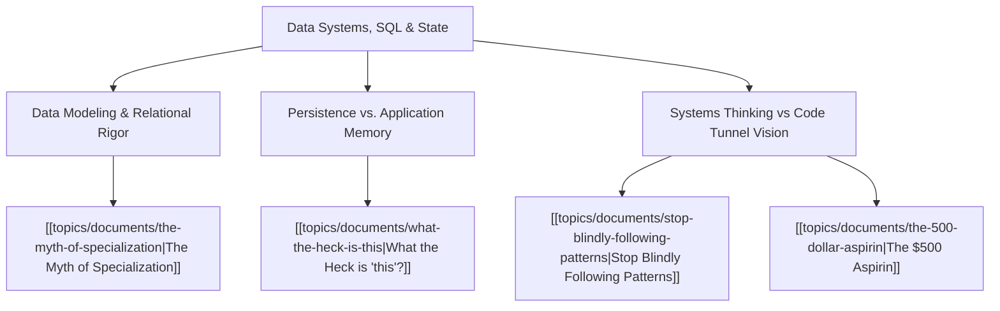

# Theme: Data Systems, SQL & State Management

## 🗺️ Theme Mind Map

---

## 📚 Related Document Vaults

<!-- prettier-ignore-start -->
<!-- markdownlint-disable MD013 -->
| Document Title                                                                        | ID        | Pillar                 | Status   | Core Angle / Contribution to Theme                                                                                     |
| :------------------------------------------------------------------------------------ | :-------- | :--------------------- | :------- | :--------------------------------------------------------------------------------------------------------------------- |
| [[topics/documents/the-myth-of-specialization\|The Myth of Specialization]]           | `TOP-014` | Pragmatic Architecture | Outlined | Why understanding SQL, relational databases, and query planning makes you 10x more effective as a full-stack engineer. |
| [[topics/documents/stop-blindly-following-patterns\|Stop Blindly Following Patterns]] | `TOP-012` | Pragmatic Architecture | Outlined | Pushing business logic into inappropriate layers vs leveraging database constraints and set-based operations.          |
| [[topics/documents/the-500-dollar-aspirin\|The $500 Aspirin]]                         | `TOP-001` | Org Culture            | Outlined | When a simple SQL view or index solves what engineering was planning to build an entire microservice for.              |
<!-- markdownlint-restore -->
<!-- prettier-ignore-end -->

---

## 💡 Key Theme Principles

- **Data Outlives Code**: Application frameworks will be rewritten three times before your database
  schema changes fundamentally.
- **Relational Integrity First**: Enforce constraints where the data lives.
