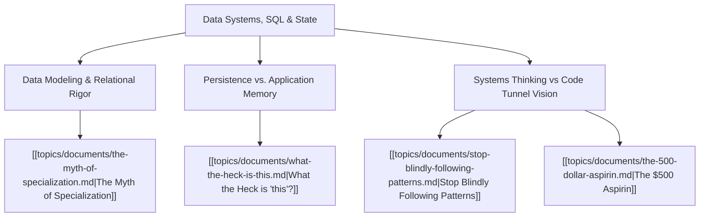

# Theme: Data Systems, SQL & State Management

## Metadata
- **Theme Name**: Data Systems, SQL & State Management
- **Category**: Software Engineering & Architecture
- **Related Themes**: [[topics/themes/architecture.md|Pragmatic Architecture]], [[topics/themes/coding-standards.md|Coding Standards]]

---

## 🗺️ Theme Mind Map

---

## 📚 Related Document Vaults

| Document Title | ID | Pillar | Status | Core Angle / Contribution to Theme |
| :--- | :--- | :--- | :--- | :--- |
| [The Myth of Specialization](topics/documents/the-myth-of-specialization.md) | `TOP-014` | Pragmatic Architecture | Outlined | Why understanding SQL, relational databases, and query planning makes you 10x more effective as a full-stack engineer. |
| [Stop Blindly Following Patterns](topics/documents/stop-blindly-following-patterns.md) | `TOP-012` | Pragmatic Architecture | Outlined | Pushing business logic into inappropriate layers vs leveraging database constraints and set-based operations. |
| [The $500 Aspirin](topics/documents/the-500-dollar-aspirin.md) | `TOP-001` | Org Culture | Outlined | When a simple SQL view or index solves what engineering was planning to build an entire microservice for. |

---

## 💡 Key Theme Principles
- **Data Outlives Code**: Application frameworks will be rewritten three times before your database schema changes fundamentally.
- **Relational Integrity First**: Enforce constraints where the data lives.
